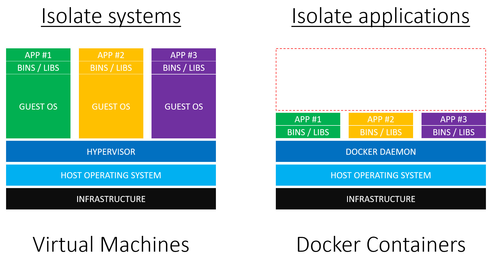
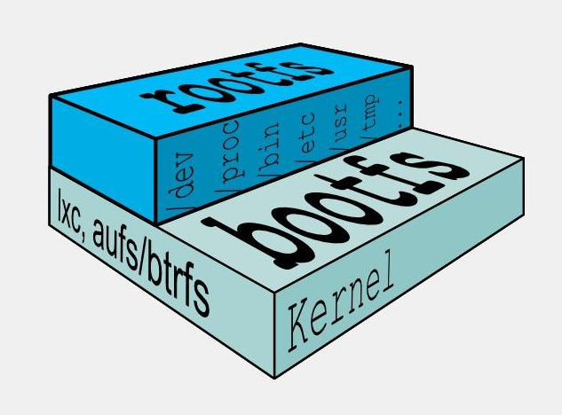
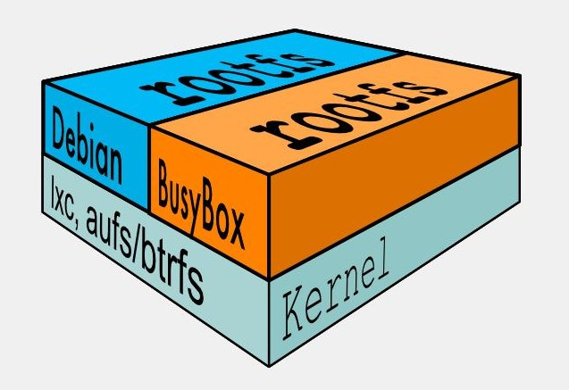
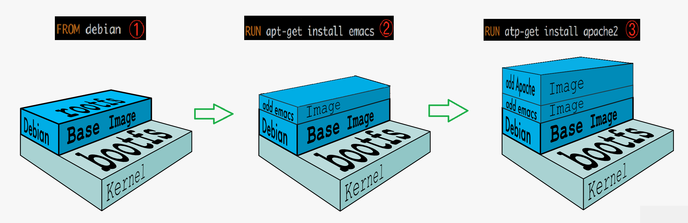
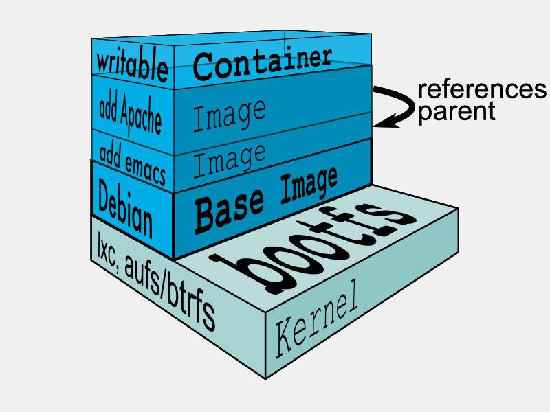

# Docker
>1. [尚硅谷2022](https://www.bilibili.com/video/BV1gr4y1U7CY?p=16 "docker")

## 一 基本概述
### 1.1 简介
Docker是基于Go语言实现的云开源项目。

Docker的主要目标是：Build, Ship and Run Any App, Anywhere，也就是通过对应用组件的封装、分发、部署、运行等生命周期的管理，使用户的APP及其运行环境能做到一次镜像，处处运行。
### 1.2 传统虚拟机和容器
+ 传统虚拟机：传统虚拟机技术基于安装在主操作系统上的虚拟机管理系统（如VMware）创建虚拟机，在虚拟机上安装从操作系统，在从操作系统中安装部署各种应用。其资源占用多、冗余步骤多、启动慢。
+ Linux容器：Linux容器是与系统其他部分分隔开的一系列进程，从另一个镜像运行，并由该镜像提供支持进程所需的全部文件。容器提供的镜像包含了应用的所有依赖项，因而在从开发到测试再到生产的整个过程中，它都具有可移植性和一致性。

Linux容器不是模拟一个完整的操作系统，而是对进程进行隔离。有了容器，就可以将软件运行所需的所有资源打包到一个隔离的容器中。容器与虚拟机不同，不需要捆绑一整套操作系统，只需要软件工作所需的库资源和设置。系统因此而变得高效轻量并保证部署在任何环境中的软件都能始终如一的运行。
|特性|容器|虚拟机|
|:-:|:-:|:-:|
|启动|秒级|分钟级|
|大小|一般为MB|一般为GB|
|速度|接近原生|比较慢|
|系统支持数量|单机支持上千个容器|一般几十个|
### 1.3 Docker运行速度快的原因
+ Docker有比虚拟机更少的抽象层：由于Docker不需要虚拟机实现硬件资源虚拟化，运行在Docker容器上的程序直接使用的都是实际物理机的硬件资源，因此在CPU、内存利用率上Docker有明显优势。
+ Docker利用的是宿主机的内核，而不需要加载操作系统OS内核：当新建一个容器时，Docker不需要和虚拟机一样重新加载一个操作系统内核。进而避免引寻、加载操作系统内核返回等比较耗时耗资源的过程。当新建一个虚拟机时，虚拟机软件需要加载OS，返回新建过程是分钟级别的。而Docker由于直接利用宿主机的操作系统，则省略了返回过程，因此新建一个Docker容器只需要几秒钟。
### 1.4 Docker基本组成部分
Docker并非一个通用的容器工具，它依赖于已经存在并运行的Linux内核环境。Docker实质上是在已经运行的Linux下制造了一个隔离的文件环境，因此它执行的效率几乎等同于所部署的Linux主机。
+ 镜像（Image）：镜像就是一个只读的模板。镜像可以用来创建Docker容器，一个镜像可以创建多个容器。
+ 容器（Container）：Docker利用容器独立运行的一个或一组应用，应用程序或服务运行在容器里面，容器就类似于一个虚拟化的运行环境，容器是用镜像创建的运行实例。
+ 仓库（Repository）：Docker仓库是集中存放镜像文件的场所，分为公开仓库和私有仓库两种。
### 1.5 Docker架构
Docker是一个C/S（Client/Server）结构的系统，后端是一个松耦合架构，众多模块各司其职。Docker守护进程运行在主机上，然后通过Socket连接从客户端访问，守护进程从容器接收命令并管理运行在主机上的容器。

## 二 安装配置
+ `yum remove docker docker-client docker-client-latest docker-common docker-latest docker-latest-logrotate docker-logrotate docker-engine`	// 删除旧版本
+ `yum -y install gcc gcc-c++`	// 安装gcc环境
+ `yum install -y yum-utils`	// 配置yum资源库
+ `yum-config-manager --add-repo https://mirrors.aliyun.com/docker-ce/linux/centos/docker-ce.repo`	// 配置资源库地址
+ `yum makecache fast`	// 更新软件包索引
+ `yum install docker-ce docker-ce-cli containerd.io docker-compose-plugin`	// 安装
+ `systemctl start docker`	// 启动
+ `docker version`	// 查看版本
+ `systemctl stop docker`	// 关闭
+ `yum remove docker-ce docker-ce-cli containerd.io`	// 卸载
+ `rm -rf /var/lib/docker /var/lib/containerd`	// 删除其它文件
+ `docker run hello-world`	// 测试
+ ```json
  mkdir -p /etc/docker
  tee /etc/docker/daemon.json <<-'EOF'
  {
  "registry-mirrors": ["https://xxx.mirror.aliyuncs.com"]
  }
  EOF	// 配置镜像加速
  ```
+ `systemctl daemon-reload`	// 刷新配置
+ `systemctl restart docker`	// 重启
+ `systemctl status docker`	// 查看状态
+ `systemctl enable docker`	// 开机启动
+ `docker info`	// 查看信息
+ `docker Command --help`	// 查看帮助

## 三 镜像
镜像是一种轻量级、可执行的独立软件包，它包含运行某个软件所需的所有内容，我们把应用程序和配置依赖打包好行成一个可交付的运行环境（包括代码、运行时需要的库、环境变量和配置文件等），这个打包好的运行环境就是镜像文件。

仓库名、标签都是\<none\>的镜像，俗称虚悬镜像。
### 3.1 基本命令
+ `docker images (-a, -q)`	// 显示镜像，-a显示所有（含历史），-q只显示id
+ `docker search Image (--limit=n)`	// 搜索镜像，--limit显示前n个
+ `docker pull Image(:Tag)`	// 下载镜像，可指定版本，默认最新
+ `docker rmi (-f) Image/ID($(docker images -aq))`	// 删除镜像，-f强制删除，可以一次删完
+ `docker system df`	// 显示镜像，容器，数据卷所占空间
+ `docker login --username=Username registry.cn-hangzhou.aliyuncs.com`	// 登录远程仓库
+ `docker logout`	// 退出远程仓库
+ `docker tag Image:Tag registry.cn-hangzhou.aliyuncs.com/UserName/RepositoryName:Tag`	// 拷贝并重命名镜像
+ `docker push registry.cn-hangzhou.aliyuncs.com/UserName/RepositoryName:Tag`	// 推送到远程仓库
+ `docker pull registry.cn-hangzhou.aliyuncs.com/Username/RepositoryName:Tag`	// 从远程仓库拉取
### 3.2 镜像加载原理
#### 3.2.1 联合文件系统
Docker中的文件存储驱动叫做storage driver。Docker最早支持的storage driver是AUFS，它实际上由一层一层的文件系统组成，这种层级的文件系统叫UnionFS。

联合文件系统（UnionFS）：联合文件系统，是一种分层、轻量级并且高性能的文件系统，它支持对文件系统的修改作为一次提交来一层层的叠加，同时可以将不同目录挂载到同一个虚拟文件系统下。

联合文件系统是Docker镜像的基础。镜像可以通过分层来进行集成，基于基础镜像可以制作具体的应用镜像。其一次同时加载多个文件系统，但从外面看起来，只能看到一个文件系统，联合加载会把各层文件系统叠加起来，这样最终的文件系统会包含所有底层的文件和目录。

后来出现的Docker版本中，除了AUFS，还支持OverlayFS、Btrfs、Device Mapper、VFS、ZFS等storage driver。
#### 3.2.2 bootfs和rootfs
bootfs（boot file system）主要包含加载器和内核，加载器主要是引导加载内核，Linux刚启动时会加载bootfs文件系统。

在Docker镜像的最底层是引导文件系统bootfs。这一层与我们典型的Linux/Unix系统是一样的，包含加载器和内核。当boot加载完成之后整个内核就都在内存中了，此时内存的使用权已经由bootfs转交给内核，此时系统也会卸载bootfs。

rootfs（root file system），在bootfs之上，包含的就是典型Linux系统中的/dev、/proc、/bin、/etc等标准目录和文件。rootfs就是各种不同的操作系统发行版，比如Ubuntu、CentOS等。

对于一个精简的OS，rootfs可以很小，只需要包括最基本的命令、工具和程序库就可以了，因为底层直接使用主机的内核，自己只需要提供rootfs就可以。所以，对于不同的Linux发行版，bootfs基本是一致的，rootfs会有差别，不同的发行版可以共用bootfs。
#### 3.2.3 镜像分层
Docker支持扩展现有镜像，创建新的镜像。新镜像是从base镜像一层一层叠加生成的。镜像分层的一个最大好处就是共享资源，方便复制迁移，方便复用。
#### 3.2.4 容器层
当容器启动时，一个新的可写层将被加载到镜像的顶部，这一层通常被称为容器层，容器层之下的都叫镜像层。所有对容器的改动，无论添加、删除、还是修改文件都只会发生在容器层中。只有容器层是可写的，容器层下面的所有镜像层都是只读的。
### 3.3 搭建私仓
Docker Registry是官方提供的工具，用于构建私有镜像仓库。Docker Registry也是Docker Hub提供的一个镜像，可以直接拉取运行。
+ `docker pull registry`	// 拉取镜像
+ `docker run -d -p 5000:5000 -v /app/myregistry/:/tmp/registry --privileged=true registry`	// 启动
+ `curl http://Host:Port/v2/_catalog`	// 查看私仓的所有镜像，Host为主机ip
+ `vim /etc/docker/daemon.json`	// 添加"insecure-registries": ["Host:Port"]后刷新重启
+ `docker tag Image:Tag Host:Port/Image:Tag`	// 拷贝并重命名镜像
+ `docker push Host:Port/Image:Tag`	// 推送到私仓
+ `docker pull Host:Port/Image:Tag`	// 拉取私仓镜像

## 四 容器
### 4.1 基本命令
+ `docker run (--name=Name -d -it -p HostPort:ContainerPort -P) Image Shell`	// 启动镜像，--name指定容器名字，-d后台运行，-it交互方式运行，要指定shell，exit退出并停止容器，ctrl+p+q只退出，-p指定端口映射，-P随机端口映射
+ `docker ps (-a -q -n=N -l)`	// 列出当前正在运行的容器，-a包含历史运行，-q只显示编号，-n显示最近创建的n个容器，-l显示最近创建容器
+ `docker rm (-f) Container/ID($docker ps -aq)`	// 删除容器，-f强制，可一次删完
+ `docker start Container/ID`	// 启动容器
+ `docker restart Container/ID`	// 重启容器
+ `docker stop Container/ID`	// 停止容器
+ `docker kill Container/ID`	// 强制停止容器
+ `docker logs Container/ID`	// 查看容器日志
+ `docker top Container/ID`	// 查看容器内运行的进程
+ `docker inspect Container/ID`	// 查看容器内部细节
+ `docker exec -it Container/ID Shell`	// 重新交互进入容器，exit不会停止容器
+ `docker attach Container/ID`	// 重新进入容器，exit会停止容器
+ `docker cp Container/ID:Source Destination`	// 拷贝容器内文件到主机
+ `docker cp Destination Container/ID:Source`	// 主机文件拷贝到容器中
+ `docker export Container/ID > Name.tar`	// 把容器内容打包为tar包
+ `cat Name.tar | docker import - ImageName:Tag`	// 恢复tar包为镜像
+ `docker commit -m="Description" -a="Author" Container ImageName:Tag`	// 提交容器使其成为一个新镜像
### 4.2 容器数据卷
卷就是目录或文件，存在于一个或多个容器中，由Docker挂载到容器，但不属于联合文件系统，因此能够绕过UnionFS，提供持续存储或共享数据。卷设计的目的就是数据的持久化，完全独立于容器的生存周期，因此Docker不会在容器删除时删除其挂载的数据卷。其有以下特点：
+ 数据卷可以在容器之间共享或重用数据
+ 卷中的更改可以直接实施生效
+ 数据卷中的更改不会包含在镜像的更新中
+ 数据卷的生命周期一直持续到没有容器使用它为止
+ `docker run -it --privileged=true -v HostDirectory:ContainerDirectory:(rw|ro) Image`	// --privileged=true扩大容器的权限解决挂载没有权限的问题，-v指定挂载，rw|ro代表读写或只读
+ `docker run -it --privileged=true --volumes-from Container --name=Name Image`	// --volumes-from继承Container的容器卷映射配置