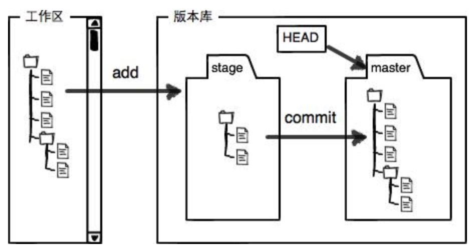

# Git
>1. [廖雪峰](https://www.liaoxuefeng.com/wiki/896043488029600/896067008724000 "git")
>2. [官网中文](http://gitbook.liuhui998.com/index.html "git")

## 一 安装与配置
+ `brew install git`	// mac安装
+ `git config --global user.name "YourName"`	// 配置用户姓名
+ `git config --global user.email "YourEmail"`	// 配置用户邮箱
+ `git config --list`	// 所有git配置信息
+ `vim .git/config`	// 项目下的git配置
+ `vim ~/.gitconfig`	// 用户下的git配置，使用--global
+ `vim /etc/gitconfig`	// 系统下的git配置，使用--system

## 二 创建仓库
+ `git init`	// 将当前目录变为git仓库
+ `git add (-f) FileName1 FileName2 ...`	// 将文件添加至暂存区，-f表示强制
+ `git add .`	// 添加当前目录下所有文件至暂存区
+ `git add DirectoryName`	// 将指定目录添加至暂存区，包括子目录
+ `git commit (-m) (--amend) "Description"`	// 将暂存区文件添加至仓库，-m添加描述信息，--amend生成新的提交覆盖上次提交

## 三 查看状态
+ `git status (-s)`	// 当前仓库状态，-s表示简洁显示
+ `git diff (--stat)`	// 查看工作区与暂存区的差异，默认所有文件，--stat表示简洁显示
+ `git diff FileName`	 // 指定单独文件
+ `git diff DirectoryName`	 // 指定目录下的所有文件
+ `git diff --cached`	// 查看暂存区与仓库的差异
+ `git diff HEAD`	// 查看工作区与仓库的差异
+ `git diff CommitId`	// 查看工作区与指定提交的差异
+ `git diff CommitId1 CommitId2`	// 查看两个提交之间的差异

## 四 版本回退
+ `git log (--graph --pretty=oneline --abbrev-commit)`	// 查看提交日志，只显示当前HEAD的引用和其先辈，HEAD/HEAD\~0代表当前版本，HEAD^/HEAD\~1为上个，依此类推
+ `git log -Num`	// 查看最近的N次提交
+ `git reset --hard Version`	// 回退版本
+ `git reset --hard CommitId`	// 回到指定版本
+ `git reflog`	// 查看所有HEAD的引用记录，用HEAD@{Num}表示，数字越小代表引用越新

## 五 工作区和暂存区

## 六 管理修改
+ `git restore FileName`	// 撤销工作区的改动，包括删除
+ `git restore --staged FileName`	// 取消暂存，回退到工作区
+ `git rm FileName`	// 删除版本库文件

## 七 远程仓库
+ `ssh-keygen -t rsa -C "YourEmail"`	// ~/.ssh中的id_rsa.pub添加至github，-t为指定密钥类型，-C为注释
+ `git remote add OriginName git@github.com:UserName/RepositoryName.git`	// 关联远程库
+ `git push (-u) OriginName BranchName`	// 推送分支至远程库，-u代表首次提交
+ `git remote -v`	// 查看远程库关联信息
+ `git remote rm OriginName`	// 删除远程库关联
+ `git clone git@github.com:UserName/RepositoryName.git`	// 从远程库克隆

## 八 分支管理
+ `git branch BranchName`	// 创建分支
+ `git switch BranchName`	// 切换分支 
+ `git switch -c BranchName`	// 创建并切换分支
+ `git branch`	// 查看分支
+ `git branch -d(-D) BranchName`	// 删除分支，-D为强制
+ `git merge BranchName`	// 合并分支至当前分支，默认使用fast-forward模式，这样删除分支后会丢失分支信息
+ `git merge --no-ff -m "Description" BranchName`	// 在合并时生成一个新的提交，这样可以保留分支信息
+ `git branch -M OldName NewName`	// 重命名分支
+ `git stash`	// 储存当前工作区
+ `git stash list`	// 查看存储的工作区
+ `git stash pop stash@{Num}`	// 恢复工作区同时删除stash内容
+ `git stash apply stash@{Num}`	// 恢复工作区
+ `git stash drop stash@{Num}`	// 删除stash内容
+ `git cherry-pick CommitId`	// 复制指定提交到当前分支
+ `git switch -c BranchName OriginName/BranchName`	// 创建关联远程分支的本地分支
+ `git branch --set-upstream-to=OriginName/BranchName BranchName`	// 本地分支关联远程分支
+ `git pull`	// 抓取远端最新提交
+ `git rebase`	// [rebase](http://gitbook.liuhui998.com/4_2.html "rebase")

## 九 标签管理
+ `git tag`	// 查看标签
+ `git tag TagName` // 默认给最新的提交打标签
+ `git tag TagName CommitId` // 给指定提交打标签
+ `git tag -a TagName -m "Description"`	// 带说明的标签
+ `git show TagName`	// 查看标签详情
+ `git tag -d TagName`	// 删除标签
+ `git push OriginName TagName(--tags)`	// 将标签推送到远程库，--tags代表所有
+ `git push OriginName :refs/tags/TagName`	// 从远程库删除标签

## 十 自定义
+ `vim .gitignore`	// 忽略特殊文件[gitignore](https://github.com/github/gitignore "gitignore")
+ `git check-ignore -v FileName`	// 检查.gitignore规则
+ `!FileName`	// 不忽略某个文件
+ `git config --global alias.OldName NewName`	// 重命名命令