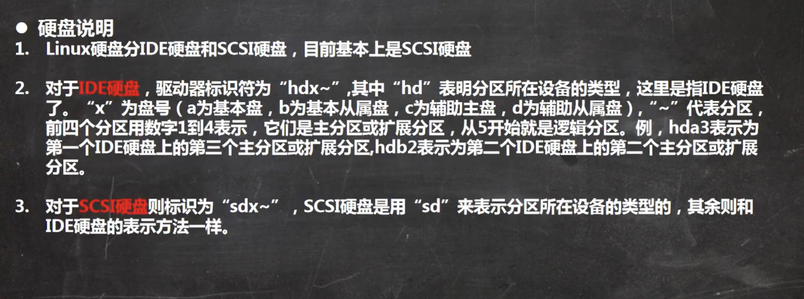
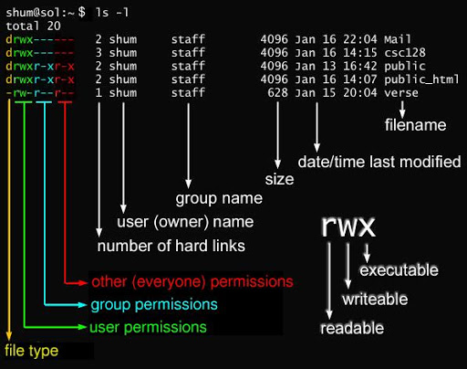
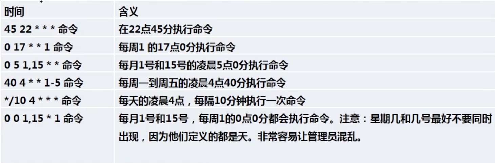
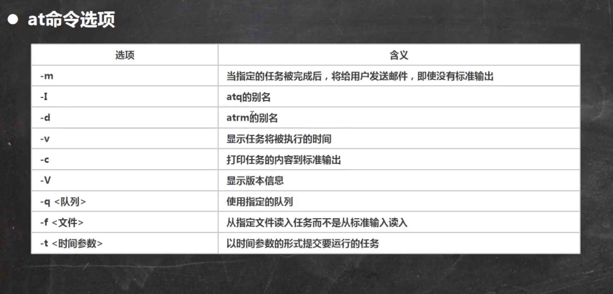
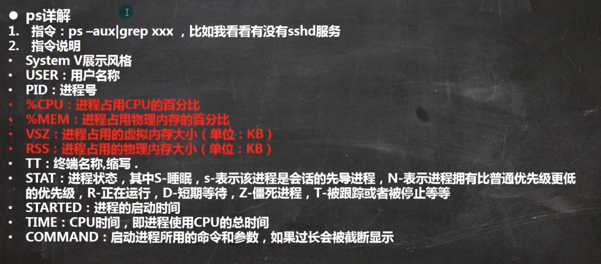

# Linux
>1. [韩顺平2018](https://www.bilibili.com/video/BV1dW411M7xL?p=9 "linux")
>2. [韩顺平2021](https://www.bilibili.com/video/BV1Sv411r7vd?p=52&vd_source=e5de1dabc977707311263a4bc0f609cc "linux")
>3. [查命令](https://wangchujiang.com/linux-command/ "linux")

## 一 网络连接
+ 桥连接：Linux可以和其他系统通信，但是可能导致ip冲突
+ NAT(常用)：Linux可以通过主机ip转换来访问外网，不会造成ip冲突
	+ `ping Ip`	// 测试主机之间网络连通性
	+ `ifconfig`	// 查看ip和网关
	+ `ipconfig`	// Windows下
+ 主机模式：Linux是独立主机，不能访问外网

## 二 系统分区
原理介绍
+ Linux无论有几个分区，归根结底只有一个根目录，一个独立且唯一的文件结构，每个分区都是用来组成整个文件系统的一部分。
+ Linux采用了一种载入的处理方法，它的整个文件系统中包含了一整套的文件和目录，且将一个分区和一个目录联系起来，这时要载入的一个分区使它的存储空间在一个目录下获得。
+ 必须的分区：/(分完boot和swap后剩下的大小)、/boot(1G)、swap(交换分区，一般是分配物理内存的1.5~2倍)。
	+ `lsblk (-f)`	// 查看所有设备挂载情况，-f输出文件系统相关信息
+ 新增硬盘步骤
	1. 在虚拟机中添加硬盘
	2. `fdisk /dev/NewDisk`	// 分区命令，先输入m显示命令列表，接着输入n新添分区，然后输入p，之后选择分区数量，最后输入w写入，若不想保存则输入q退出
	3. `mkfs -t FSType /dev/Partition`	// 格式化分区，-t指定分区类型
	4. `mount /dev/Partition DirectoryName`	// 挂载，使用命令行挂载重启后会失效
	5. `umount /dev/Partition`	// 取消挂载
	6. `vim /etc/fstab`	// 修改配置文件实现永久挂载，执行mount -a即刻生效

## 三 目录结构
|<span style="color:red">/bin; /usr/bin; /usr/local/bin</span>|/sbin; /usr/sbin; /usr/local/sbin|<span style="color:red">/home</span>|<span style="color:red">/root</span>|
|:--|--|--|--|
|常用命令|系统管理员使用命令|普通用户主目录|系统管理员|
|**/lib**|**/lost+found**|<span style="color:red">**/etc**</span>|<span style="color:red">**/usr**</span>|
|开机所需最基本的动态连接共享库|系统非法关机后会存放一些文件|所有的系统管理所需的配置文件|用户的很多应用和文件|
|<span style="color:red">**/boot**</span>|**/proc**|**/srv**|**/sys**|
|启动核心文件|内核，不能动|内核，不能动|内核，不能动|
|**/tmp**|**/dev**|<span style="color:red">**/media**</span>|<span style="color:red">**/mnt**</span>|
|临时文件|把所有硬件用文件形式存储|设备如U盘、光驱等|识别别的文件系统|
|**/opt**|<span style="color:red">**/usr/local**</span>|<span style="color:red">**/var**</span>|**/selinux**|
|安装包|安装完的软件|不断变化的文件，包括日志|安全子系统|

## 四 远程连接
+ `ssh -p Port UserName@Ip`	// 连接服务器，-p为端口，22端口
+ `exit`	// 退出服务器
+ `ssh-keygen -R Ip`	// 删除远端密钥
+ `scp -P Port (-r) UserName@Ip:绝对路径 本地绝对路径`	// 下载，-r代表文件夹
+ `scp -P Port (-r) 本地绝对路径 UserName@Ip:绝对路径`	// 上传
+ `sftp -P Port UserName@Ip`	// 建立sftp传输连接，cd代表远程操作，lcd代表本地操作
+ `get (-r) 远程路径 本地路径`	// 下载
+ `put (-r) 本地路径 远程路径`	// 上传

## 五 编辑器
### 5.1 三种模式
+ 正常模式：打开即正常模式，可以使用快捷键
+ 编辑模式：输入内容，按i、a、o、r等进入
+ 命令行模式：完成读取、保存、离开等操作，先esc进入正常模式，按:进入，q!强制退出
### 5.2 常用快捷键
+ `(n)yy`	// 复制当前行，n表示从当前行开始往下一共复制n行，p粘贴
+ `(n)dd`	// 删除，同复制
+ `/KeyWord`	// 查找，按n查找下一个
+ `noh`	// 关闭查找高亮
+ `set nu`	// 命令行下，设置文件行号
+ `set nonu`	// 取消行号
+  `G`	// 到文档末尾
+  `gg`	// 回到开头
+  `u`	// 撤销
+  `(n)shift + g`	// 先显示行号，n代表移动到第n行
+  `(n)space`	// 向右移动这一行n个字符
+  `0`	// 数字0，移动到这一行最前
+  `$`	// 移动到这一行最后
+  `ctrl + (f b)`	// f下翻，b上翻
+  `.`	// 重复上一个动作

## 六 用户管理
用户至少要属于一个组，家目录为/home，用户登录时自动进入家目录。
### 6.1 关机重启
+ `shutdown (-h -r) (now 1)`	// -h关机，-r重启，now为立刻，1表示一分钟后关机
+ `halt`	// 关机
+ `reboot`	// 重启
+ `sync`	// 保存数据，关机前执行一下
+ `uname -a`	// 查看内核版本
+ `cat /etc/shells`	// 查看所有shell，可以添加其他shell
+ `chsh -s Shell`	// 切换shell，不在shells文件里面的要使用sudo切换
### 6.2 登录注销
+ `logout`	// 注销，图形界面注销无效
### 6.3 用户
+ `useradd (-d DirectoryName -g GroupName -m -s) UserName`	// 创建用户，同时创建与用户同名的组和家目录，-d表示指定家目录，-m表示不存在家目录则创建，-g指定组，-s为登陆shell
+ `passwd UserName`	// 改密
+ `userdel (-r) UserName`	// 删除用户，-r表示同时删除家目录
+ `usermod -g GroupName UserName`	// 修改用户属组
+ `usermod -G GroupName -a UserName`	// 为用户追加属组
+ `vim /etc/sudoers` 	// 在root  ALL=(ALL) ALL这一行下插入新的一行，为用户加入su权限
### 6.4 查询切换用户
+ `id UserName`	// 查询信息
+ `groups` // 当前用户的工作所属组
+ `su - UserName`	// 切换用户，权限高切到低不需要密码，exit回到之前用户
+ `whoami`	// 查看当前用户
### 6.5 用户组
+ `groupadd GroupName`	// 创建组
+ `groupdel GroupName`	// 删除组
### 6.6 权限管理
d(目录)、l(链接文件)、-(普通文件)、c(字符设备，键盘、鼠标等)、b(块设备，硬盘等)r=4、w=2、x=1
+ `chown (-R) UserName(:GroupName) FileName`	// 更改文件目录所有者，也可以改所在组，-R表示递归更改
+ `chgrp (-R) GroupName FileName`	// 更改文件目录所在组
+ `chmod u=(rwx),g=(rwx),(o=rwx),(a=rwx) FileName`	// 更改文件目录权限，u为所有者，g为所在组，o为其他人，a=u+g+o为所有人
### 6.7 用户和组相关文件
+ 用户配置文件：/etc/passwd，用户名：口令：用户标识：组标识：注释描述：家目录：登录shell
+ 组配置文件：/etc/group，组名：口令：组标识：组内用户
+ 口令配置文件：/etc/shadow，登录名：加密口令：最后一次修改时间：最小时间间隔：最大时间间隔：警告时间：不活动时间：失效时间：标志

## 七 实用指令
|0|1|2|3|
|--|--|--|--|
|系统停机|单用户，root权限，禁止远程登陆，是用于系统维护|多用户无网络服务|多用户有网络服务，登陆后进入控制台模式|
|**4**|**5**|**6**|**运行级别（/etc/inittab）**|
|系统未使用|图形界面|系统重启|3，5使用多|

+ 开机流程：开机->BIOS->/boot->systemd进程1->运行级别->启动相应级别服务
+ CentOS6中root找回密码：启动时按enter，按e，选中内核再按e，输入空格1回车，然后输入b进入命令行界面，使用passwd修改密码
+ CentOS7中root找回密码：启动系统，在开机界面按e进入新界面，找到linux16一行，在最后输入:init=/bin/sh，然后Ctrl+x进入单用户模式，接着输入mount -o remount,rw /回车，然后输入passwd回车，修改密码，接着输入touch /.autorelabel回车，最后输入exec /sbin/init回车，完成后系统会自动重启
+ `init n`	// 更改运行级别
+ `systemctl get-default`	// 获取当前运行级别
+ `systemctl set-default Rank`	// 设置默认运行级别

### 7.1 帮助
+ `man Command`	// 查询命令
+ `help Command`	// 只能查询内置命令
### 7.2 文件目录
+ `pwd`	// 显示当前工作目录绝对路径
+ `ls (-a -l -h) (DirectoryName)`	// 列出目录下文件，-a包括隐藏文件，-l包括文件权限，-h显示计量单位
+ `cd DirectoryName(. .. ~)`	// .为当前目录，..为上一级，~为家目录，可以使用绝对路径
+ `mkdir (-p) DirectoryNmae`	// 创建目录，-p为一次创建多级目录
+ `rmdir (-p) DirectoryNmae`	// 删除空目录 ，-p为删除该目录后，若上一级变为空目录则也删除
+ `touch FileName1 FileName2`	// 创建文件
+ `cp (-r -i) Source Destination`	// 复制文件，-r为递归复制整个目录，-i为覆盖前询问
+ `rm (-r -f) (DirectoryName FileName)`	// 删除文件或目录，-r递归删除，-f强制不提示
+ `mv Source Destination`	// 移动文件或目录，也可以重命名
+ `cat (-n) FileName`	// 查看文件，只读，-n显示行号
+ `more FileName`	// 查看文件，一页一页显示
+ `less FileName`	// 看大文件方便
+ `(echo Context cat FileName ls -l) (> >>) FileName`	// 将指定内容写入文件，>为覆盖，>>为追加
+ `echo Context`	// 输出内容到控制台
+ `head (-n Num) FileName`	// 显示文件前10行，-n指定行数
+ `tail (-n Num -f) FileName`	// 显示文件最后10行，-f实时追踪更新
+ `ln (-s) Source LinkName`	// 给原文件创建链接，指向原文件，默认为硬连接；-s表示为软连接，相当于快捷方式，原文件删除之后软连接失效，而文件真正删除的条件是其所有硬连接均删除
+ `history (n)`	// 显示历史指令，n指定最近n条指令
### 7.3 时间日期
+ `date (-s) ("+%Y-%m-%d %H:%M:%S")`	// 显示当前时间，可以指定格式，-s为设置时间
+ `cal (Year)`	// 显示日历，可以显示指定年份下所有
### 7.4 搜索查找
+ `find DirectoryName (-name FileName -user UserName -size (+ -)n)`	// 在指定目录下查找，按名称，所有者，大小查找，+为大于，-为小于，单位要大写
+ `locate FileName`	// 先执行updatedb，再查找
+ `grep (-n -i) KeyWord FileName`	// 在文件中根据关键字查找，-n显示行号，-i不区分大小写，|管道符号，将前一个指令结果传给下一个指令
### 7.5 压缩和解压
+ `gzip FileName`	// 压缩，不保留原先文件
+ `gunzip FileName.gz`	// 解压
+ `zip (-r) FileName.zip FileName`	// -r压缩整个目录
+ `unzip (-d DirectoryName) FileName.zip`	// -d指定解压路径
+ `tar -cvzf FileName.tar.gz DirectoryName`	// 可以为单独文件，-c产生.tar打包文件，-v显示详细信息，-f指定压缩后的文件名，-z打包同时压缩
+ `tar -xvzf FileName.tar.gz (-C DirectoryName)`	// -x解压，-C指定目录，必须存在该目录
### 7.6 任务调度
+ `crontab -e(-r -l)`	// 执行后编辑，开头五个占位符(分钟0-59)(小时0-23)(日期1-31)(月1-12)(星期0-7，0和7都代表周日)，\*表示任何时间，，表示不连续时间，-表示连续时间，\*/n代表时间间隔，紧接脚本路径或指令，保存后退出，-r终止，-l列出当前任务调度
+ `service crond restart`	// 重启任务调度
+ `at (-I -d) (Time)`	// 使用两次Ctrl+D来结束输入。at是一次性定时计划任务，at的守护进程atd会以后台模式运行，检查作业队列来运行，默认情况下是每60秒检查作业队列，有作业时，会检查作业运行时间，如果和当前时间匹配则执行作业，执行完的任务不会再次执行，使用at时要保证atd进程的启动
### 7.7 磁盘管理
+ `df (-l -h)`	// 查看系统磁盘使用情况，-h带计量单位，-l表示本地
+ `du (-h -a -c --max-depth=) DirectoryName`	// 查看指定目录磁盘情况，-a代表包括文件，--max-depth指定查询深度，-c列出明细同时增加汇总
+ `tree DirectoryName`	// 将目录按树形表示
### 7.8 网络管理
+ `vim /etc/sysconfig/network-scripts/ifcfg-eth0`	// ONBOOT设置为yes，BOOTPROTO设置为static，必须要设置IPADDR、GATEWAY、DNS1
+ `service network restart`	// 重启网络服务
+ `hostname`	// 显示主机名，可以修改/etc/hostname文件，然后重启
+ `vim /etc/hosts`	// 设置IP和主机的映射
+ `C:\Windows\System32\drivers\etc\hosts`	// Windows下配置映射
+ `ipconfig /displaydns`	// Windows下查看DNS域名解析缓存
+ `ipconfig /flushdns`	// Windows手动清理DNS缓存
+ 域名解析分析：浏览器先检查浏览器缓存中有没有该域名解析的IP地址，如果有就先调用这个IP完成解析；如果没有则检查DNS解析器缓存，如果有直接返回IP完成解析，这两个缓存为本地解析器缓存。如果本地解析器没有找到对应的映射，则检查系统hosts文件中有没有配置对应的域名IP映射，如果有则完成解析。如果以上均没有，则到域名服务器DNS进行解析。
### 7.9 进程管理
+ `ps (-aux -ef)`	// 查看系统执行的进程，-e显示所有进程，包括父进程，-f表示全格式，-a显示当前终端所有进程，-u以用户格式显示，-x显示后台运行参数
+ `kill (-9) Pid`	// 终止进程，-9强制
+ `killall ProcessName`	// 通过名字终止进程
+ `pstree (-u -p)`	// 树状显示，-p显示pid，-u显示所属用户
+ `service ServerName (start stop restart reload status)`	// 服务指令，防火墙为iptables，/etc/init.d下的服务是用service管理的
+ `setup`	// 查看系统所有服务，\*表示是自启动的，按空格取消自启动
+	`chkconfig (--Level n) (ServerName) (on off) (--list)`	// 显示或设置每个服务的各个运行级别状态，管理的服务在/etc/init.d下，需要重启才生效
+ `systemctl (start stop restart reload status) ServerName`	// CentOS7.0很多服务不再使用service，而是systemctl，防火墙名字为firewalld，管理的服务在/usr/lib/systemd/system下
+ `systemctl list-unit-files`	 // 查看服务开机启动状态，可以用grep过滤
+ `systemctl enable ServerName`	// 设置自启动，默认就对3，5的级别生效
+ `systemctl disable ServerName`	// 关闭自启动
+ `systemctl is-enabled ServerName`	// 查询是否为自启动
+ `telnet Ip Port`	// 检查linux某个端口是否在监听，并可以访问
+ `firewall-cmd --permanent --add-port=Port/Protocol`	// 打开端口
+ `firewall-cmd --permanent --remove-port=Port/Protocol`	// 关闭端口
+ `firewall-cmd --reload`	// 重新载入，让改动生效
+ `firewall-cmd --query-port=Port/Protocol`	// 查询端口是否开放	
+ `top (-d -i -p)`	// 动态监控进程，-d指定更新间隔，-p监控指定进程，-i不显示闲置和僵尸进程，交互中输入u指定显示某个用户的进程，k终止某个进程，P以cpu使用率排序，默认就是，M以内存使用率排序，N以Pid排序，q退出
+ `netstat (-anp)`	// 查看网络情况，-an指按一定顺序输出，-p显示哪个进程在调用
+ `lsof -i:Port`	// 查看端口占用情况
+ `nohup Command > File 2>&1 &`	// 后台运行命令，结果输出到File中
### 7.10 备份与恢复
+ `dump (-u -Num(0~9) -f -T -j) Directory/FileSystem`	// 分卷或增量备份，-u在/etc/dumpdares中记录备份的文件系统、层级、日期等，-Num代表备份层级，-f指定备份后文件名，-T指定开始备份的时间与日期，-j压缩备份成bz2格式，目录不支持增量备份
+ `dump -W`	// 显示需要备份的文件及其最后一次备份的层级、日期等
+ `restore (-C -i -r -t) (-f) Directory/FileSystem`	// 恢复备份，-C对比模式，将备份文件与已存在文件对比，-i交互模式，在进行还原操作时将依次询问用户，-r还原模式，-t查看备份文件有哪些，-f指定文件

## 八 包管理
### 8.1 Ubuntu
/etc/apt/sources.list，备份后更换为国内源。默认不支持远程登录，要安装openssh-server然后启动。
+ `apt-get update`	// 更新源
+ `apt-get (-f) install Package`	// 安装，-f修复安装
+ `apt-get install Package --reinstall`	// 重新安装
+ `apt-get remove Package`	// 删除包
+ `apt-get remove Package --purge`	// 删除包，包括配置信息
+ `apt-get dist-upgrade`	// 可能会为了解决软件包冲突而删除一些已安装的软件包，也可能会为了解决软件包依赖问题安装新的软件包
+ `apt-get upgrade`	// 更新已安装的包
+ `apt-get autoclean`	// 清理没用的包
+ `apt-get source Package`	// 下载包源代码 
+ `apt-cache search Package`	// 搜索包
+ `apt-cache show Package`	// 获取包相关信息
+ `apt-cache depends Package`	// 查看包的相关依赖
+ `apt-cache rdepends Package`	// 查看该包被哪些包依赖
+ `apt list --installed`	// 查看已安装的包
+ `apt list --upgradable`	// 查看可更新的包
### 8.2 CentOS
/etc/yum.repos.d/CentOS-Base.repo，备份后换为国内源。默认支持远程登陆。
+ `yum (-h -y) install Package`	// 安装包，-h显示帮助信息，-y所有选项都为yes
+ `yum reinstall Package`	// 重新安装
+ `yum groupinstall Group`	// 安装软件组
+ `yum list | grep Package`	// 查找包
+ `yum list available`	// 列出没安装的包
+ `yum list installed`	// 显示已安装的包
+ `yum grouplist`	// 显示所有可用软件组
+ `yum update`	// 更新所有需要更新的包
+ `yum upgrade`	 // 更新，但会删除老包
+ `yum update Package`	// 更新指定包
+ `yum groupupdate Group`	// 更新软件组
+ `yum check-update`	// 检查系统中需要更新的包
+ `yum info Package`	// 显示包信息
+ `yum groupinfo Group`	// 显示软件组信息
+ `yum search Keywords`	// 根据关键字查找信息
+ `yum remove Package`	// 删除包
+ `yum groupremove Group`	// 删除软件组
+ `yum clean`	// 清除缓存文件
+ `yum makecache`	// 重新生成缓存，换源后执行
+ `yum repolist`	// 查看yum源信息

## 九 Shell语法
脚本需要以`#!/bin/bash`开头。
### 9.1 变量
+ `./FileName.sh`	// 使用相对路径或者绝对路径，需要可执行权限
+ `sh FileName.sh`	// 可以不需要执行权限
+ 变量分为系统环境变量和用户自定义变量，系统变量有`HOME`、`PWD`、`SHELL`、`USER`、`PATH`等。
+ `set`	// 查看当前shell中所有变量，使用变量要用$引用
+ `A=100`	// 定义变量，等号中间不要打空格，变量名称可以由字母、数字和下划线组成，但是不能以数字开头，变量名称一般大写
+ `readonly A=100`	// 定义变量，readonly为静态变量，不能unset
+ `unset a`	// 撤销变量
+ `a=$(Command)`	// 将命令结果赋值给变量，也可以使用反引号
+ `export A=100`	// 将变量输出为环境变量，只在当前终端当前用户有效，要永久设置环境变量需要在用户级别或者系统级别文件中设置，如~/bash_profile，/etc/profile
+ `env`	// 查看所有环境变量
+ ```shell
	:<<!
  hello		// 多行注释
  !
	```
+ `$n`	// 命令行参数， \$0代表命令本身，\$1\-\$9代表第一到第九个参数，十个以上的参数要用大括号包含，如\${10}
+ `$*`	// 表示命令行所有参数，把所有参数看成一个整体
+ `$@`	// 同上，但把每个参数区分对待
+ `$#`	// 表示参数的个数
+ `$$`	// 当前进程的进程号
+ `$!`	// 后台运行的最后一个进程的进程号
+ `$?`	// 最后一次执行的命令的返回状态。如果这个变量的值为0，说明上一个命令正确执行，非0则说明执行不正确
### 9.2 运算式
+ `A=$((2+3))`
+ `A=$[2+3]`	// 推荐
+ `A=expr 2 + 3`	// expr运算符之间要有空格，乘法要用\\\*表示，赋给变量要用反引号包括
### 9.3 判断符
+ `=`		// 字符串比较
+ `-it`	// 小于，整数比较
+ `-le`	// 小于等于
+ `-eq`	// 等于
+ `-gt`	// 大于
+ `-ge`	// 大于等于
+ `-ne`	// 不等
+ `-r`	// 文件有读权限 
+ `-w`	// 有写权限
+ `-x`	// 有执行权限
+ `-f`	// 文件存在并且是常规文件
+ `-e`	// 文件存在
+ `-d`	// 文件存在并且是个目录
### 9.4 流程控制
+ ```shell
	if [ Condition ]	// 括号两边必须有空格
	then
			...
	elif [ Condition ]
	then
			...
	fi
	```
+ ```shell
	case $a in
	"1")
	...
	;;
	"2")
	...
	;;
	*)
	...
	;;
	esac
	```
+ ```shell
	for i in "$@"
	do
		echo "$i"
	done
	```
+ ```shell
	for(( i=1;i<10;i++ ))
	do
		...
	done
	```
+ ```shell
	while [ Condition ]
	do
		...
	done
	```
+ `read (-p -t) Var`	// -p指定读取值时的提示符，-t指定读取时等待的时间，如果没用在指定的时间内输入，就不再等待了
### 9.5 函数
+ `basename Path Suffix`	// 系统函数，删除所有前缀包括最后一个/，Suffix文件后缀，指定后可去除
+ `dirname Path`	// 返回完整路径最后/的前面的部分，与basename相反
+ ```shell
	function funName(){
		...
	}
	// 自定义函数，用funName调用
	```

## 十 日志管理
### 10.1 日志介绍
+ 日志文件是重要的系统信息文件，其中记录了许多重要的系统事件，包括用户的登录信息、系统的启动信息、系统的安全信息、邮件相关信息、各种服务相关信息等。
+ 日志对于安全来说也很重要，它记录了系统每天发生的各种事情，通过日志来检查错误发生的原因， 或者受到攻击时攻击者留下的痕迹。
+ 可以这样理解日志是用来记录重大事件的工具。

/var/log目录就是系统日志文件的保存位置。
|日志文件|说明|
|-|-|
|<span style="color:red">/var/log/boot.log</span>|系统启动日志|
|<span style="color:red">/var/log/cron</span>|系统定时任务相关日志|
|/var/log/cups|打印信息的日志|
|/var/log/dmesg|系统在开机时内核自检信息|
|/var/log/btmp|错误登录日志，是二进制文件,要用lastb命令查看|
|<span style="color:red">/var/log/lastlog</span>|所有用户最后一次登录时间的日志，用lastlog命令查看|
|<span style="color:red">/var/log/maillog</span>|邮件信息日志|
|<span style="color:red">/var/log/messages</span>|系统重要消息的日志。这个日志文件中会记录Linux系统的绝大多数重要信息。如果系统出现问题，首先要检查的应该就是这个日志文件|
|<span style="color:red">/var/log/secure</span>|验证和授权方面的信息，只要涉及账户和密码的程序都会记录，如系统的登录、ssh的登录、su切换用户、sudo授权，甚至添加用户和修改用户密码都会记录在这个日志文件中|
|/var/log/wtmp|永久记录所有用户的登录、注销信息，同时记录系统的启动、重启、关机时间，用last查看|
|<span style="color:red">/var/log/ulmp</span>|当前已经登录的用户的信息。这个文件会随着用户的登录和注销而不断变化，只记录当前登录用户的信息。要使用w、who、users等命今查看|

/etc/rsyslog.conf记录了管理日志相关的配置，编辑文件时的格式为\*.\*，分别代表日志类型与日志级别。
|日志类型|说明|
|-|-|
|auth|pam产生的日志|
|authpriv|ssh、ftp等登录信息的验证信息|
|corn|时间任务相关|
|kern|内核|
|lpr|打印|
|mail|邮件|
|mark(syslog)-rsyslog|服务内部信息，时间标识|
|news|新闻组|
|user|用户程序|
|uucp|unix to unix copy主机之间相关的通信|
|local1-7|自定义的日志设备|

|日志级别|说明（从上到下记录的信息越来越少）|
|-|-|
|debug|有调试信息|
|info|一般信息，最常用|
|notice|最具有重要性的普通条件的信息|
|warning|警告级别|
|err|错误级别，阻止某个功能不能正常工作的信息|
|crit|严重级别，阻止整个系统不能正常工作的信息|
|alert|需要立即修改的信息|
|emerg|内核崩溃等信息|
|none|什么都不记录|

+ `ps -aux | grep "rsyslog | grep -v "grep"`	// 查询rsyslogd是否启动，-v指定前面不包含某个关键字的结果
+ `systemctl list-unit-files | grep rsyslog`	// 查询rsyslogd的自启动状态
### 10.2 日志轮替
日志轮替就是把旧的日志文件移动并改名，同时建立新的空日志文件，当旧日志文件超出保存的范围之后，就会进行删除。/etc/logtotate.conf记录了全局的日志轮替策略，也可以单独给某个日志指定策略，写到/etc/logrotate.d目录下。
|参数|说明|
|-|-|
|daily|日志的轮替周期是每天|
|weekly|日志的轮替周期是每周|
|monthly|日志的轮替周期是每月|
|rotate Num|保留的日志文件的个数。Num为0表示没有备份|
|compress|日志轮替时，旧的日志进行压缩|
|create mode owner group|建立新日志，同时指定新日志的权限与所有者和所属组|
|mail address|当日志轮替时，输出内容通过邮件发送到指定的邮件地址|
|missingok|如果日志不存在，则忽略该日志的警告信息|
|notifempty|如果日志为空文件，则不进行日志轮替|
|minsize Size|日志轮替的最小值。也就是日志一定要达到这个最小值才会轮替，否则就算时间达到也不轮替|
|size Size|日志只有大于指定大小才进行日志轮替，而不是按照时间轮替|
|dateext|使用日期作为日志轮替文件的后缀|
|sharedscripts|在此关键字之后的脚本只执行一次|
|prerotate/endscript|在日志轮替之前执行脚本命令|
|postrotate/endscript|在日志轮替之后执行脚本命令|

日志轮替之所以可以在指定的时间备份日志，是依赖系统定时任务。在/etc/cron.daily下就会发现这个目录中是有logrotate文件，logrotate是通过这个文件并依赖定时任务执行的。

Centos7使用logrotate进行日志轮替管理，要想改变日志轮替文件名字，通过/etc/logrotate.conf配置文件中的dateext参数：
+ 如果配置文件中有dateext参数，那么日志会用日期来作为日志文件的后缀，如secure- 20201010。这样日志文件名不会重叠，也就不需要日志文件的改名，只需要指定保存日志个数，删除多余的日志文件即可。
+ 如果配置文件中没有dateext参数，日志文件就需要进行改名了。当第一次进行日志轮替时，当前的secure日志会自动改名为secure.1，然后新建secure日志，用来保存新的日志。当第二次进行日志轮替时，secure.1会自动改名为secure.2，当前的secure日志会自动改名为secure.1，然后也会新建secure日志，用来保存新的日志，以此类推。
### 10.3 内存日志
+ `journalctl`	// 查看全部（内存日志，重启清空）
+ `journalctl -n N`	// 查看最新N条
+ `journalctl --since Start --until End`	// 查看起止时间至终止时间的日志
+ `journalctl -p err`	// 报错日志
+ `journalctl -o verbose`	// 日志详细内容
+ `journalctl _PID=1245 _COMM=sshd`	// 查看包含这些参数的日志