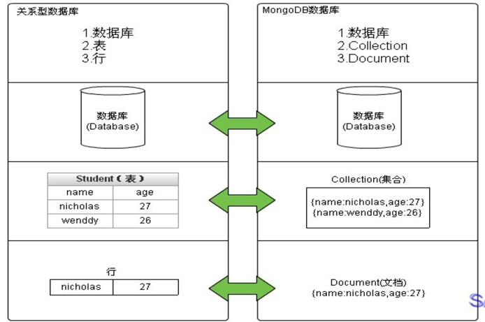
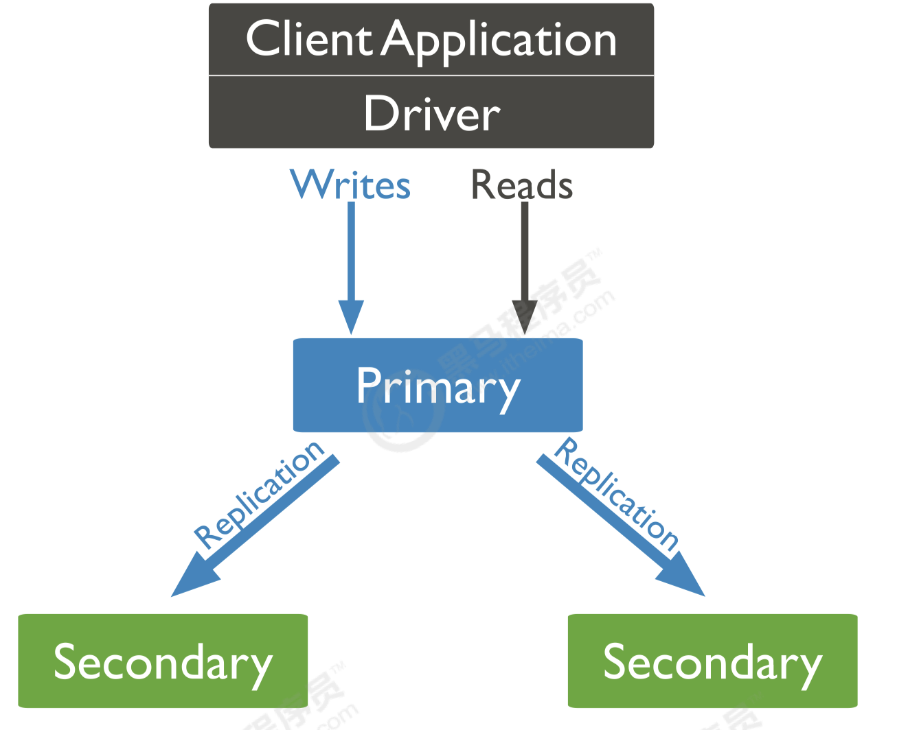
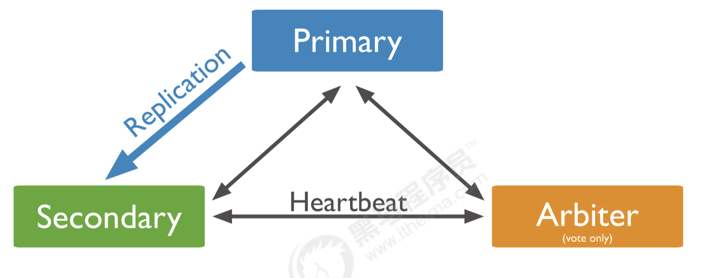
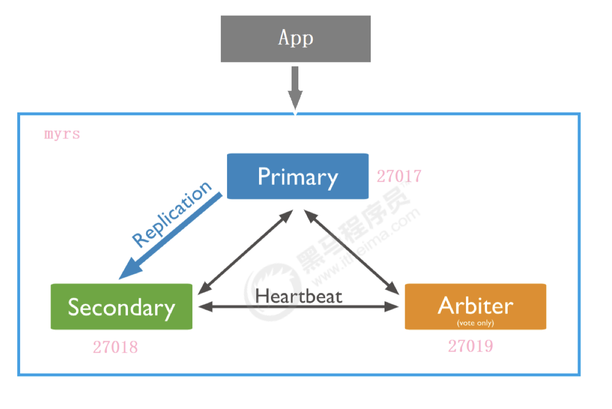
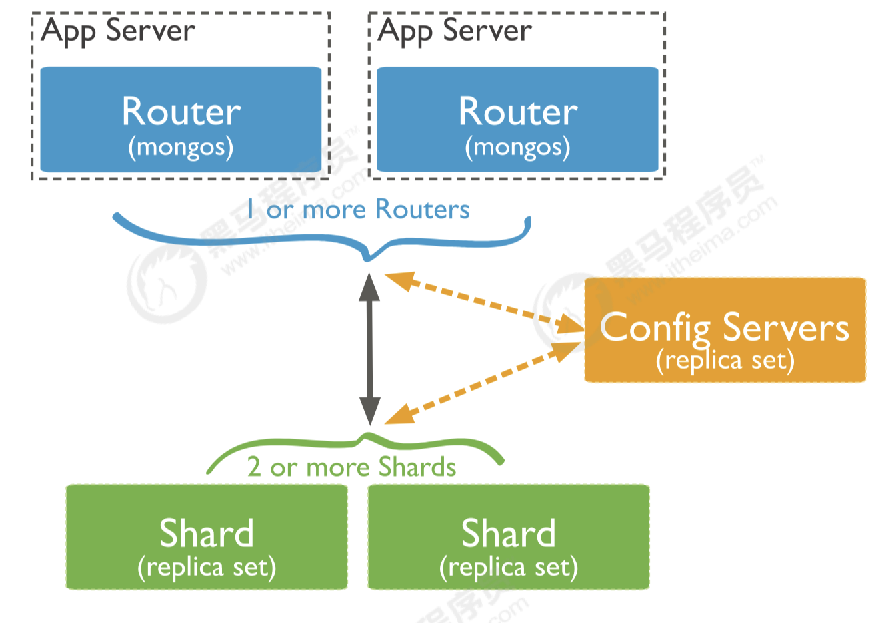
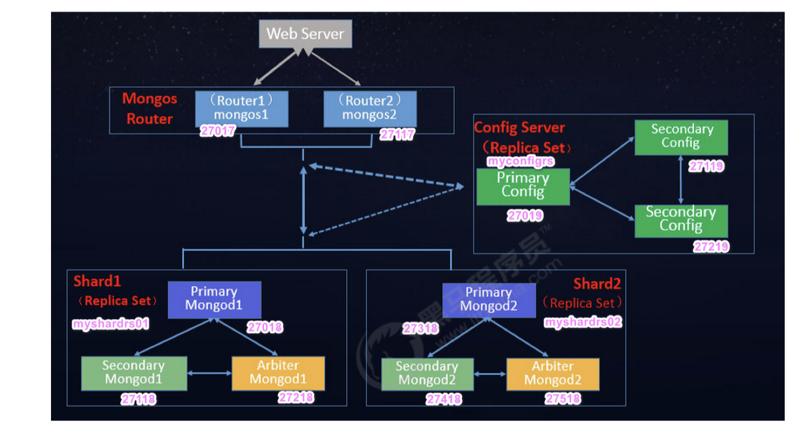

# MongoDB
> 1. [黑马2019](https://www.bilibili.com/video/BV1bJ411x7mq?p=2&vd_source=e5de1dabc977707311263a4bc0f609cc "mongodb")

## 一 相关概念
### 1.1 业务应用场景
传统的关系型数据库，在数据操作的三高需求以及web2.0的网站需求面前，显得力不从心，而mongodb可以应对三高需求。
+ High performance：对数据库高并发读写的需求
+ Huge storage：对海量数据的高效率存储的访问需求
+ High scalability && High availability：对数据库的高可扩展性和高可运用性的需求

具体的应用场景如：（数据量大、读写频繁、价值较低的数据）
+ 社交场景：存储用户信息，以及用户发表的朋友圈信息等
+ 游戏场景：存储游戏用户信息，用户的装备、积分等以直接内嵌文档的形式存储，方便查询，高效率存储和访问
+ 物流场景：存储订单信息，订单状态在运输过程中会不断变更，以内嵌的数组形式来存储，一次查询就能将订单的所有变更读取出来
+ 物联网场景：存储所有接入的智能设备信息，以及设备汇报的日志信息，并对这些信息进行多维度的分析
+ 视频直播：存储用户信息，点赞互动信息等

什么时候选择 Mongodb呢？除了架构选型上，除了上述三个特点之外，还要考虑下面这些问题：
+ 应用不需要事务及复杂连接支持
+ 新应用，需求会变，数据模型无法确定，想快速迭代开发
+ 应用需要2000～3000及以上的每秒查询
+ 应用需要TB甚至PB级别数据存储
+ 应用发展迅速，需要能快速水平扩展
+ 应用要求存储的数据不丢失
+ 应用需要99.999%高可用
+ 应用需要大量的地理位置查询，文本查询
### 1.2 简介
+ MongoDB是一个开源、高性能、无模式的文档型数据库，当初的设计就是用于简化开发和方便扩展，是NoSQL数据库产品中的一种。是最像关系型数据库的非关系型数据库。
+ 它支持的数据结构非常松散，是一种类似于JSON的格式叫BSON，所以它既可以存储比较复杂的数据类型，又相当的灵活。
+ MongoDB中的记录是一个文档，它是一对键值组成的数据结构。MongoDB文档类似于JSON对象，即一个文档认为就是一个对象。键的数据类型是字符型，它的值除了使用基本的一些类型外，还可以包括其他文档、普通数组和文档数组。
### 1.3 体系结构
与关系型数据对比：
|SQL术语|MongoDB术语|说明|
|:-:|:-:|:-:|
|database|database|数据库|
|table|collection|表|
|row|document|行|
|column|field|字段|
|index|index|索引|
|table joins||表连接，mongodb不支持|
||嵌入文档|代替表连接|
|primary key|primary key|主键|
### 1.4 数据模型
+ MongoDB的最小存储单位就是文档对象。文档对象对应于关系型数据库的行。数据在MongoDB中以 BSON文档的格式存储在磁盘上。
+ BSON是一种类JSON的二进制形式的存储格式，BSON和JSON一样，支持内嵌的文档对象和数组对象。
+ BSON支持内嵌的文档对象和数组对象，具有轻量性、可遍历性、高效性的三个特点，可以有效描述非结构化数据和结构化数据。这种格式的优点是灵活性高，但它的缺点是空间利用率不是很理想。
+ BSON中，除了基本的JSON类型：string，integer，boolean，double，null，array和object，还使用了特殊的数据类型。这些类型包括 date，object id，binary data，regular expression和code。
+ BSON数据类型列表：
|数据类型|描述|举例|
|:-:|:-:|---|
|string|字符串，utf-8编码的字符串才是合法的|{"x": "string"}|
|integer|整型数值，可分为 32 位或 64 位|{"x": NumberInt()}; {"x": NumberLong()}|
|boolean|布尔值|{"x": true}|
|double	|双精度浮点值，数字的默认类型|{"x": 11.22}|
|array|值的集合|{"x": []}|
|null|空值或未定义的对象|{"x": null}|
|symbol|shell不支持，会将数据库中的符号类型自动转成字符串|
|date|日期时间|{"x": new Date()}|
|object id|文档的id|{"x": ObjectId()}|
|binary data|二进制数据，shell中无法使用|
|code| javaScript代码 |{"x": function(){...}}|
|regular expression|正则表达式类型，javascript正则语法|{"x": /string/i}|
### 1.5 特点
+ 高性能： MongoDB提供高性能的数据持久性。特别是，对嵌入式数据模型的支持减少了数据库系统上的I/O活动。索引支持更快的查询，并且可以包含来自嵌入式文档和数组的键。
+ 高可用性：MongoDB的复制工具称为副本集，它可提供自动故障转移和数据冗余。
+ 高扩展性：MongoDB提供了水平可扩展性作为其核心功能的一部分。 分片将数据分布在一组集群的机器上。 从3.4开始，MongoDB支持基于片键创建数据区域。在一个平衡的集群中，MongoDB将一个区域所覆盖的读写只定向到该区域内的那些片。 
+ 丰富的查询支持： MongoDB支持丰富的查询语言。 
+ 其他特点：如无模式（动态模式）、灵活的文档模型。

## 二 安装配置
+ `tar -xvzf mongodb; tar -xvzf mongosh`	// 把mongosh放到mongodb/bin下面
+ `cd mongodb; mkdir log; mkdir -p data/db`	// 新建日志和数据目录
+ `vim mongod.conf`	// 修改配置文件
```yml
systemLog:
   # 日志输出指定为文件 
   destination: file
   # 日志文件的路径 
   path: "" 
   # 重新启动时, 将新条目附加到现有日志文件的末尾
   logAppend: true 
storage:
   # 存储数据的目录, storage.dbPath设置仅适用于mongod
   dbPath: "" 
   journal:
      # 启用或禁用持久性日志以确保数据文件保持有效和可恢复
      enabled: true
processManagement:
   # 守护进程模式
   fork: true 
   # 指定用于保存mongos或mongod进程的进程ID的文件位置, 其中mongos或mongod将写入其PID
   pidFilePath: ""
net:
   # 对所有ip开放访问
   bindIp: 0.0.0.0
   # 端口
   port: 27017
```
+ `export PATH=MongodbPath:$PATH`	// 设置环境变量
+ `mongod -f ConfigPath`	// 通过配置文件启动
+ `mongosh --Port=Port`	// 启动客户端，指定端口
+ `use admin; db.shutdownServer()`	// 关闭服务，如果没有开启认证，必须是从localhost登陆的，才能执行关闭服务命令。非localhost的、通过远程登录的，必须有登录且必须登录用户有对admin操作权限才可以。

## 三 基本操作
### 3.1 数据库操作
+ `use dbName`	 // 选择数据库，如果数据库不存在则自动创建，在MongoDB中，数据库只有在集合创建后才会创建
+ `show dbs/databases`	// 查看有权限查看的所有的数据库
+ `db`	// 查看当前正在使用的数据库，MongoDB中默认的数据库为test，如果你没有选择数据库，集合将存放在test数据库中
有一些数据库名是保留的，可以直接访问这些有特殊作用的数据库。
+ admin：从权限的角度来看，这是root数据库。要是将一个用户添加到这个数据库，这个用户自动继承所有数据库的权限。一些特定的服务器端命令也只能从这个数据库运行，比如列出所有的数据库或者关闭服务器。
+ local：这个数据永远不会被复制，可以用来存储限于本地单台服务器的任意集合
+ config：当Mongo用于分片设置时，config数据库在内部使用，用于保存分片的相关信息。
+ `db.dropDatabase()`	// 删除当前数据库，该数据库必须已经持久化，否则不起作用
### 3.2 集合操作
+ `db.createCollection(ctName)`	// 创建集合，当向一个集合中插入一个文档的时候，如果集合不存在，则会自动创建集合
+ `show collections/tables`	// 查看当前数据库的集合
+ `db.ctName.drop()`	// 删除集合
### 3.3 文档操作
+ `db.ctName.insertOne(Document, {writeConcern: Document, ordered: Bool})`	// 单个插入，Document为JSON格式，ordered默认为true，按顺序插入数组中的文档，如果其中一个文档出现错误，MongoDB将返回而 不处理数组中的其余文档。如果为false，则执行无序插入，如果其中一个文档出现错误，则继续处理数组中的主文档。writeConcern为写入策略
+ `db.ctName.insertMany([Documents], {writeConcern: Document, ordered: Bool})`	// 多个文档插入，如果没有指定\_id字段为主键，则会默认生成，放在try-catch里可以捕捉异常
+ `db.ctName.find(Query, Projection)`	// 查询集合中的数据，Query设置条件匹配，Projection设置显示的字段，取1代表显示，0代表不显示
+ `db.ctName.findOne(Query, Projection)` // 查询满足条件的第一条数据
+ `db.ctName.updateOne(Query, Update, {upsert: Bool, multi: Bool})`	// 覆盖式的修改，Query设置查询条件，Update为要修改的文档，Upsert设置为true，则在没有与查询条件匹配的文档时创建新文档。默认值为false，如果找不到匹配项，则不会插入新文档。Multi设置为true，则更新符合查询条件的多个文档。如果设置为false，则更新一个文档。默认值为false。
+ `db.ctName.updateMany(Query)`    // 批量修改
+ `db.ctName.delete(Query)`	// 删除文档
+ `db.ctName.deleteMany(Query)`	// 批量删除
+ `db.ctName.countDocuments(Query)`	// 统计查询
+ `db.ctName.find().limit(Num)`	// 返回Num条数据
+ `db.ctName.find().skip(Num)`	// 跳过前Num数据
+ `db.ctName.find().sort(Manner)`	// Manner为根据键进行排序，取1为生序，-1为降序。skip、limilt、sort三个放在一起执行的时候，执行的顺序是先sort，然后是skip，最后是limit

|常用符号|作用|
|:-:|:-:|
|$inc| 递增|
|$set| 部分修改 |
|$gt|大于|
|$lt|小于|
|$gte|大于等于|
|$lte|小于等于|
|$ne|不等于|
|$in|包含|
|$nin|不包含|
|$and|与|
|$or|或|

## 四 索引
### 4.1 概述
+ 索引支持在MongoDB中高效地执行查询。如果没有索引，MongoDB必须执行全集合扫描，以选择与查询语句匹配的文档。这种扫描全集合的查询效率是非常低的，特别在处理大量的数据时，查询可以要花费几十秒甚至几分钟，这对网站的性能是非常致命的。
+ 如果查询存在适当的索引，MongoDB可以使用该索引限制必须检查的文档数。 索引是特殊的数据结构，它以易于遍历的形式存储集合数据集的一小部分。索引存储特定字段或一组字段的值，按字段值排序。索引项的排序支持有效的相等匹配和基于范围的查询操作。此外，MongoDB还可以使用索引中的排序返回排序结果。
3. MongoDB索引使用的是B-Tree，MySQL是B+Tree。
### 4.2 索引类型
+ 单字段索引
MongoDB支持在文档的单个字段上创建用户定义的升序/降序索引，称为单字段索引。对于单个字段索引和排序操作，索引键的排序顺序并不重要，因为MongoDB可以在任何方向上遍历索引。
+ 复合索引
MongoDB还支持多个字段的用户定义索引，即复合索引。复合索引中列出的字段顺序具有重要意义。
+ 其他索引
	+ 地理空间索引：为了支持对地理空间坐标数据的有效查询，MongoDB提供了两种特殊的索引，返回结果时使用平面几何的二维索引和返回结果时使用球面几何的二维球面索引
	+ 文本索引：MongoDB提供了一种文本索引类型，支持在集合中搜索字符串内容。这些文本索引不存储特定于语言的停止词（例如“the”、“a”、“or”）， 而将集合中的词作为词干，只存储根词
	+ 哈希索引：为了支持基于散列的分片，MongoDB提供了散列索引类型，它对字段值的散列进行索引。这些索引在其范围内的值分布更加随机，但只支持相等匹配，不支持基于范围的查询
### 4.3 索引操作
+ `db.ctName.getIndexes()`	// 查看集合中所有索引情况
+ `db.ctName.createIndex(Keys)`	// 根据字段创建索引，取1为生序，-1为降序
+ `db.ctName.dropIndex(Index)`	// 删除指定索引
+ `db.ctName.dropIndexes()`	// 删除所有索引，\_id的字段的索引是无法删除的，只能删除非\_id字段的索引
+ `db.ctName.find().explain()`	// 查看查询的情况，如查询耗费的时间、是 否基于索引查询等

## 五 副本集
### 5.1 简介
MongoDB中的副本集是一组维护相同数据集的mongod服务。副本集可提供冗余和高可用性，是所有生产部署的基础。也可以说，副本集类似于有自动故障恢复功能的主从集群。通俗的讲就是用多台机器进行同一数据的异步同步，从而使多台机器拥有同一数据的多个副本，并且当主库挂掉时在不需要用户干预的情况下自动切换其他备份服务器做主库。而且还可以利用副本服务器做只读服务器，实现读写分离，提高负载。
+ 冗余和数据可用性
	+ 复制提供冗余并提高数据可用性。通过在不同数据库服务器上提供多个数据副本，复制可提供一定级别的容错功能，以防止丢失单个数据库服务器。
	+ 在某些情况下，复制可以增加读取性能，因为客户端可以将读取操作发送到不同的服务器上，在不同数据中心维护数据副本可以增加分布式应用程序的数据位置和可用性。还可以为专用目的维护其他副本，例如灾难恢复，报告或备份。
+ MongoDB中的复制
	+ 副本集是一组维护相同数据集的mongod实例。副本集包含多个数据承载节点和可选的一个仲裁节点。在承载数据的节点中，一个且仅一个成员被视为主节点，而其他节点被视为从节点。
	+ 主节点接收所有写操作。
+ 主从复制和副本集区别
	+ 主从集群和副本集最大的区别就是副本集没有固定的主节点，整个集群会选出一个主节点，当其挂掉后，又在剩下的从节点中选中其他节点为主节点，副本集总有一个活跃点和一个或多个备份节点。
### 5.2 副本集的三个角色
+ 两种类型
	+ 主节点：数据操作的主要连接点，可读写
	+ 从节点：数据冗余备份节点，可以读或选举
+ 三种角色
	+ 主要成员：主要接收所有写操作，就是主节点
	+ 副本成员：从主节点通过复制操作以维护相同的数据集，即备份数据，不可写操作，但可以读操作（但需要配置），是默认的一种从节点类型
	+ 仲裁者：不保留任何数据的副本，只具有投票选举作用。当然也可以将仲裁服务器维护为副本集的一部分，即副本成员同时也可以是仲裁者，也是一种从节点类型。仲裁者将永远是仲裁者，而主要人员可能会退出并成为次要人员，而次要人员可能成为选举期间的主要人员。如果你的副本+主节点的个数是偶数，建议加一个仲裁者，形成奇数，容易满足大多数的投票。如果你的副本+主节点的个数是奇数，可以不加仲裁者。
### 5.3 副本集的构建
一主一副一仲裁
#### 5.3.1 创建主节点
+ `mkdir -p mongodb/replica_sets/myrs_27017/log`	// log目录
+ `mkdir -p mongodb/replica_sets/myrs_27017/data/db`	// data目录
+ `vim mongodb/replica_sets/myrs_27017/mongod.conf`	// 配置文件
```yml
systemLog:
   # 日志输出指定为文件 
   destination: file
   # 日志文件的路径 
   path: "" 
   # 重新启动时, 将新条目附加到现有日志文件的末尾
   logAppend: true 
storage:
   # 存储数据的目录, storage.dbPath设置仅适用于mongod
   dbPath: "" 
   journal:
      # 启用或禁用持久性日志以确保数据文件保持有效和可恢复
      enabled: true
processManagement:
   # 守护进程模式
   fork: true 
   # 指定用于保存mongos或mongod进程的进程ID的文件位置, 其中mongos或mongod将写入其PID
   pidFilePath: ""
net:
   # 对所有ip开放访问
   bindIp: 0.0.0.0
   # 端口
   port: 
replication:
	 # 副本集名称, 需要相同
   replSetName: ReplicaName
```
+ `mongod -f ConfigPath`	// 启动
#### 5.3.2 创建副本节点
+ `mkdir -p mongodb/replica_sets/myrs_27018/log`	// log目录
+ `mkdir -p mongodb/replica_sets/myrs_27018/data/db`	// data目录
+ `vim mongodb/replica_sets/myrs_27018/mongod.conf`	// 配置文件
+ `mongod -f ConfigPath`	// 启动
#### 5.3.3 创建仲裁节点
+ `mkdir -p mongodb/replica_sets/myrs_27019/log`	// log目录
+ `mkdir -p mongodb/replica_sets/myrs_27019/data/db`	// data目录
+ `vim mongodb/replica_sets/myrs_27019/mongod.conf`	// 配置文件
+ `mongod -f ConfigPath`	// 启动
#### 5.3.4 初始化副本集和主节点
+ `mongosh --port=27017`	// 连接主节点
+ `rs.initiate()`	// 使用默认配置初始化副本集
+ `rs.conf()`	// 查看副本集的配置
+ `rs.status()`	// 查看副本集状态，此输出使用从副本集的其他成员发送的心跳包中获得的数据反映副本集的当前状态
+ `rs.add("Ip:Host")`	// 添加副节点，需要打开对应端口
+ `rs.addArb("Ip:Host")`	// 添加仲裁节点
+ `rs.secondaryOk()`	// 副节点获取读权限
+ `rs.stepDown()` 	// 告知副本集本机要下线，关闭服务之前执行，依次关闭仲裁者、副本节点、主节点
#### 5.3.5 主节点选举原则
MongoDB在副本集中，会自动进行主节点的选举，主节点选举的触发条件：
+ 主节点故障
+ 主节点网络不可达（默认心跳信息为10秒）
+ 人工干预（rs.stepDown(600)）

选举规则是根据票数来决定谁获胜：
+ 票数最高，且获得了大多数成员的投票支持的节点获胜。大多数的定义为：假设副本集投票成员数量为N，则大多数为N/2 + 1。例如：3个投票成员，则大多数的值是2。当副本集内存活成员数量不足大多数时，整个副本集将无法选举出Primary，复制集将无法提供写服务，处于只读状态
+ 若票数相同，且都获得了大多数成员的投票支持的，数据新的节点获胜。数据的新旧是通过操作日志oplog来对比的
+ 在获得票数的时候，priority参数影响重大。可以通过设置priority来设置额外票数。优先级即权重，取值为0～1000，相当于可额外增加 0～1000的票数，优先级的值越大，就越可能获得多数成员的投票。指定较高的值可使成员更有资格成为主要成员，更低的值可使成员更不符合条件
+ 主节点和副节点的优先级各为1，但仲裁节点，优先级是0，要注意是，官方说了，仲裁节点的优先级必须是0，不能是别的值。即不具备选举权，但具有投票权
+ `var cfg=rs.conf(); cfg.members[Num].priority=Num; rs.reconfig(cfg)`	// 修改节点优先级
+ `var cfg=rs.conf(); cfg.members[0].host="Ip:Host"; rs.reconfig(cfg)`	// 修改主节点ip

## 六 分片
### 6.1 概念
+ 分片是一种跨多台机器分布数据的方法，MongoDB使用分片来支持具有非常大的数据集和高吞吐量操作的部署。
+ 换句话说，分片是指将数据拆分，将其分散存在不同的机器上的过程。有时也用分区 来表示这个概念。将数据分散到不同的机器上，不需要功能强大的大型计算机就可以储存更多的数据，处理更多的负载。
+ 具有大型数据集或高吞吐量应用程序的数据库系统可能会挑战单个服务器的容量。例如，高查询率会耗尽服务器的CPU容量。有两种解决系统增长的方法：垂直扩展和水平扩展：
	+ 垂直扩展意味着增加单个服务器的容量，例如使用更强大的CPU，添加更多RAM或增加存储空间量
	+ 水平扩展意味着划分系统数据集并加载多个服务器，添加其他服务器以根据需要增加容量。虽然单个机器的总体速度或容量可能不高，但每台机器处理整个工作负载的子集，可能提供比单个高速大容量服务器更高的效率。扩展部署容量只需要根据需要添加额外的服务器，这可能比单个机器的高端硬件的总体成本更低
### 6.2 分片集群包含的组件
MongoDB分片群集包含以下组件：
+ 分片：每个分片包含分片数据的子集。每个分片都可以部署为副本集。
+ 路由：mongos充当查询路由器，在客户端应用程序和分片集群之间提供接口。
+ 配置服务器：配置服务器存储群集的元数据和配置设置。从MongoDB 3.4开始，必须将配置服务器部署为副本集。
### 6.3 分片集群构建
两个分片节点副本集（3+3），一个配置节点副本集（3），两个路由节点（2），共11个服务节点。必须依次启动配置节点、分片节点、路由节点
#### 6.3.1 第一套副本集
+ `mkdir -p mongodb/sharded_cluster/myshardrs01_27018/log`	// log目录
+ `mkdir -p mongodb/sharded_cluster/myshardrs01_27018/data/db`	// 数据目录
+ `vim mongodb/sharded_cluster/myshardrs01_27018/mongod.conf`	// 修改配置文件
```yml
systemLog:
   # 日志输出指定为文件 
   destination: file
   # 日志文件的路径 
   path: "" 
   # 重新启动时, 将新条目附加到现有日志文件的末尾
   logAppend: true 
storage:
   # 存储数据的目录, storage.dbPath设置仅适用于mongod
   dbPath: "" 
   journal:
      # 启用或禁用持久性日志以确保数据文件保持有效和可恢复
      enabled: true
processManagement:
   # 守护进程模式
   fork: true 
   # 指定用于保存mongos或mongod进程的进程ID的文件位置, 其中mongos或mongod将写入其PID
   pidFilePath: ""
net:
   # 对所有ip开放访问
   bindIp: 0.0.0.0
   # 端口
   port: 
replication:
	 # 副本集名称, 需要相同
   replSetName: ReplicaName
sharding:
   # 分片角色, config server需要设置为configsvr
   clusterRole: shardsvr
```
+ `mkdir -p mongodb/sharded_cluster/myshardrs01_27118/log`	// log目录
+ `mkdir -p mongodb/sharded_cluster/myshardrs01_27118/data/db`	// 数据目录
+ `vim mongodb/sharded_cluster/myshardrs01_27118/mongod.conf`	// 修改配置文件
+ `mkdir -p mongodb/sharded_cluster/myshardrs01_27218/log`	// log目录
+ `mkdir -p mongodb/sharded_cluster/myshardrs01_27218/data/db`	// 数据目录
+ `vim mongodb/sharded_cluster/myshardrs01_27218/mongod.conf`	// 修改配置文件
+ `mongod -f ConfigPath`	// 启动三个节点
+ `rs.initiate()`	// 副本集初始化
+ `rs.conf()`	// 查看副本集的配置
+ `rs.status()`	// 查看副本集状态，此输出使用从副本集的其他成员发送的心跳包
+ `rs.add("Ip:Host")`	// 添加副节点，需要打开对应端口
+ `rs.addArb("Ip:Host")`	// 添加仲裁节点
+ `var cfg=rs.conf(); cfg.members[0].host="Ip:Host"; rs.reconfig(cfg)`	// 修改主节点ip
#### 6.3.2 第二套副本集
同上，一主一副一仲裁。
#### 6.3.3 配置节点副本集
同上，一主两副。
#### 6.3.4 第一个路由节点
+ `mkdir -p mongodb/sharded_cluster/mymongos_27017/log`	// log目录
+ `vim mongodb/sharded_cluster/mymongos_27017/mongos.conf`	// 修改配置文件
```yml
systemLog:
   # 日志输出指定为文件 
   destination: file
   # 日志文件的路径 
   path: "" 
   # 重新启动时, 将新条目附加到现有日志文件的末尾
   logAppend: true 
processManagement:
   # 守护进程模式
   fork: true 
   # 指定用于保存mongos或mongod进程的进程ID的文件位置, 其中mongos或mongod将写入其PID
   pidFilePath: ""
net:
   # 对所有ip开放访问
   bindIp: 0.0.0.0
   # 端口
   port: 
sharding:
   # 指定配置节点副本集
   configDB: myconfigrs/120.26.164.63:27019,120.26.164.63:27119,120.26.164.63:27219
```
+ `sh.addShard("ShardName/120.26.164.63:27018,120.26.164.63:27118,120.26.164.63:27218")`	//添加分片
+ `sh.status()`	// 查看分片情况
+ `use admin; db.runCommand({removeShard: "ShardName"})`	// 移除分片
+ `sh.enableSharding("dbName")`	// 为数据库开启分片功能
+ `sh.shardCollection(dbName.ctName, {Key: Manner})`	// 对集合开启分片，要将集合中某个字段作为分片键，还要选择分片策略
+ 哈希策略：对于基于哈希的分片，MongoDB计算一个字段的哈希值，并用这个哈希值来创建数据块。在使用基于哈希分片的系统中，拥有相近片键的文档很可能不会存储在同一个数据块中，因此数据的分离性更好一些
+ 范围策略：对于基于范围的分片，MongoDB按照片键的范围把数据分成不同部分。假设有一个数字的片键：想象一个从负无穷到正无穷的直线，每一个片键的值都在直线上画了一个点。MongoDB把这条直线划分为更短的不重叠的片段，并称之为数据块 ，每个数据块包含了片键在一定范围内的数据。在使用片键做范围划分的系统中，拥有相近片键的文档很可能存储在同一个数据块中，因此也会存储在同 一个分片中
+ 基于范围的分片方式与基于哈希的分片方式性能对比：
	+ 基于范围的分片方式提供了更高效的范围查询，给定一个片键的范围，分发路由可以很简单地确定哪个数据块存储了请求需要的数据，并将请求转发到相应的分片中，不过，基于范围的分片会导致数据在不同分片上的不均衡，有时候带来的消极作用会大于查询性能的积极作用。比如，如果片键所在的字段是线性增长的，一定时间内的所有请求都会落到某个固定的数据块中，最终导致分布在同一个分片中。在这种情况下，一小部分分片承载了集群大部分的数据，系统并不能很好地进行扩展
	+ 与此相比，基于哈希的分片方式以范围查询性能的损失为代价，保证了集群中数据的均衡。哈希值的随机性使数据随机分布在每个数据块中，因此也随机分布在不同分片中。但是也正由于随机性，一个范围查询很难确定应该请求哪些分片，通常为了返回需要的结果，需要请求所有分片
	+ 如无特殊情况，一般推荐使用哈希策略
+ `db.printShardingStatus()`	// 显示集群的详细信息
+ `sh.isBalancerRunning()`	// 查看均衡器是否工作（需要重新均衡时系统才会自动启动，不用管它）
+ `sh.getBalancerState()`	// 查看当前Balancer状态
+ `db.ctName.stats()`	// 查看单个集合的完整情况
+ `use config; db.settings.save({_id: "chunksize", value: Num})`	// 设置数据块大小，单位为M
#### 6.3.5 第二个路由节点
同时，但无需再次分片设置，因为分片配置都保存到了配置服务器中了。

## 七 安全认证
### 7.1 用户和角色权限简介
默认情况下，MongoDB实例启动运行时是没有启用用户访问权限控制的，也就是说，在实例本机服务器上都可以随意连接到实例进行各种操作，MongoDB不会对连接客户端进行用户验证，这是非常危险的。
mongodb官网上说，为了能保障mongodb的安全可以做以下几个步骤：
1. 使用新的端口，默认的27017端口如果一旦知道了ip就能连接上，不太安全。
2. 设置mongodb的网络环境，最好将mongodb部署到公司服务器内网，这样外网是访问不到的。公司内部访问使用vpn等。
3. 开启安全认证。认证要同时设置服务器之间的内部认证方式，同时要设置客户端连接到集群的账号密码认证方式。

为了强制开启用户访问控制，则需要在MongoDB实例启动时使用选项--auth，或在指定启动配置文件中添加选项auth=true 。在开始之前需要了解一下概念：
1. 启用访问控制：MongoDB使用的是基于角色的访问控制（Role-Based Access Control, RBAC）来管理用户对实例的访问。通过对用户授予一个或多个角色来控制用户访问数据库资源的权限和数据库操作的权限，在对用户分配角色之前，用户无法访问实例。
2. 角色：在MongoDB中通过角色对用户授予相应数据库资源的操作权限，每个角色当中的权限可以显式指定，也可以通过继承其他角色的权限，或者两都都存在的权限。
3. 权限：在角色定义时可以包含一个或多个已存在的角色，新创建的角色会继承包含的角色所有的权限。在同一个数据库中，新创建角色可以继承其他角色的权限，在admin数据库中创建的角色可以继承在其它任意数据库中角色的权限。

常用的内置角色：
+ 数据库用户角色：read、readWrite
+ 所有数据库用户角色：readAnyDatabase、readWriteAnyDatabase、userAdminAnyDatabase、dbAdminAnyDatabase
+ 数据库管理角色：dbAdmin、dbOwner、userAdmin
+ 集群管理角色：clusterAdmin、clusterManager、clusterMonitor、hostManager
+ 备份恢复角色：backup、restore
+ 超级用户角色：root
+ 内部角色：system

角色说明：
|角色|权限描述|
|:-:|:-:|
|read|可以读取指定数据库中任何数据|
|readWrite|可以读写指定数据库中任何数据，包括创建、重命名、删除集合|
|readAnyDatabase|可以读取所有数据库中任何数据（除了数据库config和local之外）|
|readWriteAnyDatabase|可以读写所有数据库中任何数据（除了数据库config和local之外）|
|userAdminAnyDatabase|可以在指定数据库创建和修改用户（除了数据库config和local之外）|
|dbAdminAnyDatabase|可以读取任何数据库以及对数据库进行清理、修改、压缩、获取统计信息、执行检查等操作（除了数据库config和local之外）|
|dbAdmin|可以读取指定数据库以及对数据库进行清理、修改、压缩、获取统计信息、执行检查等操作|
|userAdmin|可以在指定数据库创建和修改用户|
|clusterAdmin|可以对整个集群或数据库系统进行管理操作|
|backup|备份MongoDB数据最小的权限|
|restore|从备份文件中还原恢复MongoDB数据（除了system.profile集合）的权限|
|root|超级账号，超级权限|
### 7.2 单实例环境
#### 7.2.1 添加用户和权限
+ `use dbName; db.createUser({user: "Name", pwd: "Password", roles: [{"role": "Role", "db": "dbName"}]})`	// 在指定数据库创建用户，如果指定db为""，则代表在所有数据库上都有效，我创建了root
+ `db.system.users.find()`	// 查看已经创建的用户
+ `db.dropUser("UserName")`	// 删除用户
+ `db.changeUserPassword("UserName", "NewPassword")`	// 修改密码
+ `db.auth("UserName", "Password")`	// 用户认证
#### 7.2.2 开启认证
有两种方式开启权限认证启动服务：一种是参数方式，一种是配置文件方式。
1. 在启动时指定参数 --auth，如：mongod -f ConfigPath --auth
2. 配置文件方式（推荐）：添加
	```yml
	security:
	   #开启授权认证 
	   authorization: enabled
	```

开启了认证的情况下的客户端登录：
1. 先连接再认证，如mongosh --port=Port
2. 连接时直接认证，mongosh --port=Port  --authenticationDatabase dbName -u Username -p Password
### 7.3 副本集环境
#### 7.3.1 通过主节点创建一个管理员账号
#### 7.3.2 创建副本集认证的key文件
+ `openssl rand -base64 90 -out ./mongo.keyfile`	// 每个节点都需要有，一定要保证密钥文件一致，文件位置随便。但是为了方便查找，建议每台机器都放到一个固定的位置，都放到和配置文件一起的目录中
#### 7.3.3 修改配置文件
+ `vim mongod.conf` // 添加
```yml
	security:
   #KeyFile鉴权文件
   keyFile: ""
   #开启认证方式运行
   authorization: enabled
```
#### 7.3.4 重启副本集
#### 7.3.5 在主节点添加普通账号
### 7.4 分片环境
同副本集环境，只是mongos比mongod少了authorization: enabled的配置。