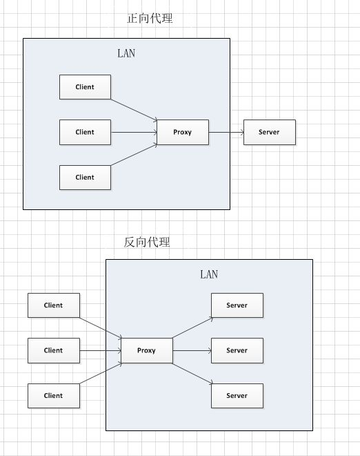
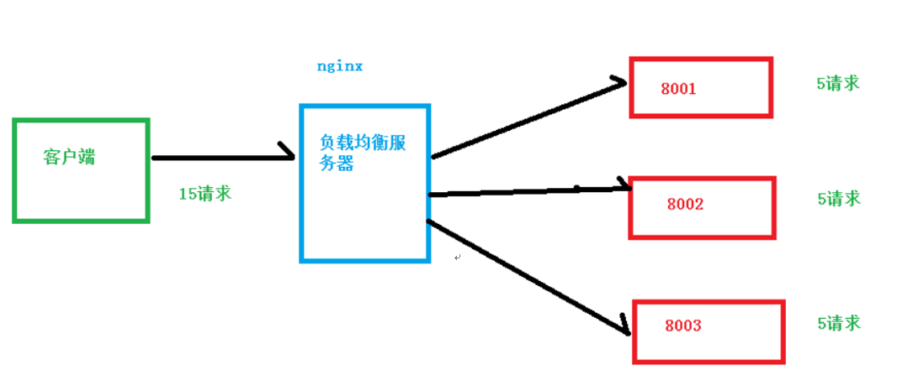
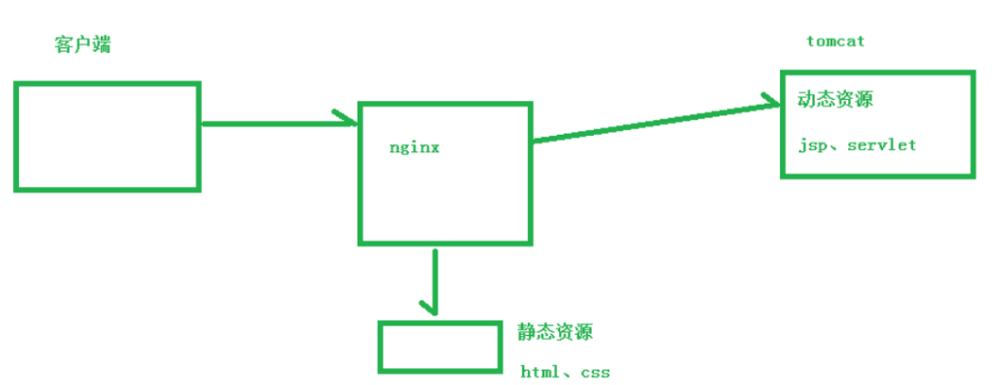

# Nginx
>1. [尚硅谷2019](https://www.bilibili.com/video/BV1zJ411w7SV?spm_id_from=333.788.player.switch&vd_source=e5de1dabc977707311263a4bc0f609cc&p=6 "git")

## 一 基本介绍
### 1.1 Nginx概念
Nginx是一个高性能的HTTP和反向代理服务器，特点是占有内存少，并发能力强。

Nginx可以作为静态页面的Web服务器，同时还支持CGI协议的动态语言，比如Perl、PHP等，但是不支持Java。Java程序只能通过与Tomcat配合完成。Nginx专为性能优化而开发，性能是其最重要的考量，实现上非常注重效率，能经受高负载的考验，有报告表明能支持高达50,000个并发连接数。
### 1.2 正向代理与反向代理
正向代理是一个位于客户端和目标服务器之间的代理服务器（中间服务器）。为了从原始服务器取得内容，客户端向代理服务器发送一个请求，并且指定目标服务器，之后代理向目标服务器转交并且将获得的内容返回给客户端。正向代理的情况下客户端必须要进行一些特别的设置才能使用。

反向代理正好相反。对于客户端来说，反向代理就好像目标服务器。并且客户端不需要进行任何设置。客户端向反向代理发送请求，接着反向代理判断请求走向何处，并将请求转交给客户端。客户端并不会感知到反向代理后面的服务，也因此不需要客户端做任何设置，只需要把反向代理服务器当成真正的服务器就好了。
正向代理中，Proxy和Client同属一个LAN，对Server透明；反向代理中，Proxy和Server同属一个LAN，对Client透明。实际上Proxy在两种代理中做的事都是代替收发请求和响应，不过从结构上来看正好左右互换了下，所以把前者那种代理方式叫做正向代理，后者叫做反向代理。
### 1.3 负载均衡
增加服务器的数量，然后将请求分发到各个服务器上，将原先请求集中到单个服务器上的情况改为将请求分发到多个服务器上，将负载分发到不同的服务器，也就是我们所说的负载均衡。

### 1.4 动静分离
为了加快网站的解析速度，可以把动态页面和静态页面由不同的服务器来解析，加快解析速度。降低原来单个服务器的压力。

## 二 安装
+ `sudo apt-get install build-essential libtool libpcre3 libpcre3-dev zlib1g-dev openssl`	// 安装依赖
+ `tar -xvzf nginx.tar.gz`	// 解压
+ `make && make install`	// 编译安装，被安装至/usr/local
+ `nginx -v`	// 查看版本
+ `nginx`	// 启动
+ `nginx -s stop`	// 关闭
+ `nginx -s reload`	// 重新加载配置文件

## 三 配置文件
Nginx安装目录下，其默认的配置文件都放在这个目录的==conf==下，而主配置文件==nginx.conf==也在其中，后续对Nginx的使用基本上都是对此配置文件进行相应的修改。
### 3.1 全局块
从配置文件开始到events块之间的内容，主要会设置一些影响Nginx服务器整体运行的配置指令，主要包括配置运行Nginx服务器的用户（组）、允许生成的worker process数、进程PID存放路径、日志存放路径和类型以及配置文件的引入等。
+ `worker process`	// 值越大，可以支持的并发处理量也越多，但是会受到硬件、软件等设备的制约
### 3.2 events块
events块涉及的指令主要影响Nginx服务器与用户的网络连接，常用的设置包括是否开启对多work process下的网络连接进行序列化，是否允许同时接收多个网络连接，选取哪种事件驱动模型来处理连接请求，每个word process可以同时支持的最大连接数等。
+ `worker_connections`	// 支持的最大连接数，这部分的配置对Nginx的性能影响较大，在实际中应该灵活配置。
### 3.3 http块
这算是Nginx服务器配置中最频繁的部分，代理、缓存和日志定义等绝大多数功能和第三方模块的配置都在这里。需要注意的是：http块包括http全局块、server块。
#### 3.3.1 http全局块
http全局块配置的指令包括文件引入、MIME-TYPE定义、日志自定义、连接超时时间、单连接请求数上限等。
upstream（上游服务器设置，主要为反向代理、负载均衡相关配置，upstream的指令用于设置一系列的后端服务器，设置反向代理及后端服务器的负载均衡）
#### 3.3.2 server块
server块和虚拟主机有密切关系，虚拟主机从用户角度看，和一台独立的硬件主机是完全一样的，该技术的产生是为了节省互联网服务器硬件成本。每个http块可以包括多个server块，而每个server块就相当于一个虚拟主机。同时每个server块也分为全局server块，以及可以同时包含多个locaton块。

全局server块最常见的配置是本虚拟机主机的监听配置和本虚拟主机的名称或IP配置。

location块的主要作用是基于Nginx服务器接收到的请求字符串（例如server_name/uri-string），对虚拟主机名称（也可以是IP别名）之外的字符串（例如前面的/uri-string）进行匹配，对特定的请求进行处理。地址定向、数据缓存和应答控制等功能，还有许多第三方模块的配置也在这里进行。