# RabbitMQ
> 1. [动力节点2023](https://www.bilibili.com/video/BV1nX4y1B7xw?p=9&vd_source=e5de1dabc977707311263a4bc0f609cc "rabbitmq")

## 一 简介
### 1.1 RabbitMQ
RabbitMQ是一个广泛使用的消息服务器，采用Erlang语言编写，是一种开源的实现AMQP的消息中间件。

RabbitMQ最初起源于金融系统，它的性能及稳定性都非常出色，AMQP协议，Advanced Message Queuing Protocol，高级消息队列协议，是应用层协议的一个开放标准，为面向消息的中间件设计。
### 1.2 消息中间件
简单来说，消息中间件就是指保存数据的一个容器（服务器），可以用于两个系统之间的数据传递。消息中间件一般有三个主要角色：生产者、消费者、消息代理（消息队列、消息服务器）。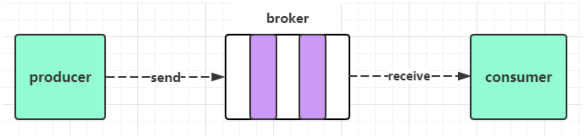
### 1.3 常用的消息中间件
+ RabbitMQ
+ Kafka
+ RocketMQ
+ Pulsar

## 二 MQ的应用场景
### 2.1 异步处理
例：下订单 -> 向MQ发消息之后就可以返回 -> 其他异步操作（加积分、发红包、发短信...）
同步是阻塞的（会造成等待），异步是非阻塞的（不会等待），大流量高并发请求、批量数据传递，就可以采用异步处理，提升系统吞吐量。
### 2.2 系统解耦
多个系统之间，不需要直接交互，通过消息进行业务流转：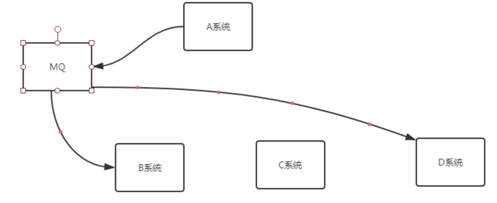
### 2.3 流量削峰
高负载请求、任务的缓冲处理：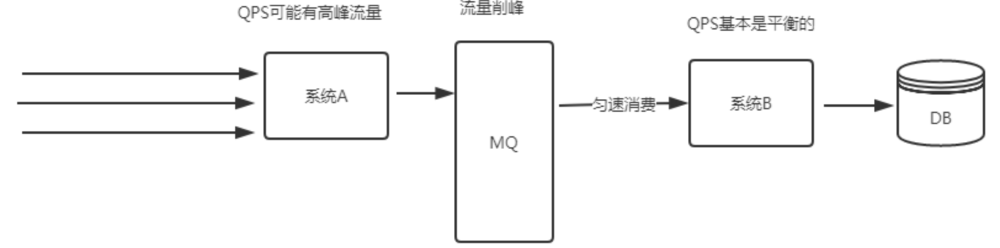
### 2.4 日志处理
主要是用kafka这个服务器来做，日志处理是指将消息队列用于在日志处理中，比如Kafka解决大量日志传输的问题。ELK 日志处理解决方案：
loger.error() -> logstash收集消息 -> 发送消息的kafka -> elastic search -> Kibana

## 三 安装配置
### 3.1 下载安装Erlang
下载时一定要注意版本兼容性，版本兼容说明地址：[版本选择](https://www.rabbitmq.com/which-erlang.html)
+ `yum -y install gcc glibc-devel make ncurses-devel openssl-devel xmlto perl wget gtk2-devel binutils-devel wxWidgets-devel`	// 先安装一些依赖库
+ `cd /usr/bin; ln -s wx-config-3.0 wx-config`	// 创建软连接
+ `tar -xvzf otp_src.tar.gz; mkdir erlang`	// 解压
+ `cd opt_src; ./configure --prefix=/usr/local/erlang; make; make install`	// 执行脚本
+ `export PATH=ErlangPath:$PATH`	// 配置环境变量
### 3.2 下载安装RabbitMQ
+ `tar -xvf rabbitmq.tar.xz`	// 解压
+ `export PATH=RabbitMQPath:$PATH`	// 配置环境变量
+ `rabbitmq-server -detached`	// 守护进程启动
+ `rabbitmqctl status`	// 查看状态
+ `rabbitmqctl shutdown`	// 关闭

## 四 管理命令
+ `rabbitmqctl add_user Username Password`	// 创建用户
+ `rabbitmqctl list_users`	// 查看用户
+ `rabbitmqctl set_user_tags Username administrator`	// 设置用户角色
+ `rabbitmqctl set_permissions Username ".*" ".*" ".*"`	// 设置用户权限
+ `rabbitmqctl list_permissions`	// 查看用户权限
+ `rabbitmq-plugins list`	// 查看插件使用情况
+ `rabbitmq-plugins enable rabbitmq_management`	// 启用web管理插件
+ `rabbitmq-plugins disenable Plugin`	// 停用插件
+ `HOST:15672`	// 访问web页面

## 五 工作模型
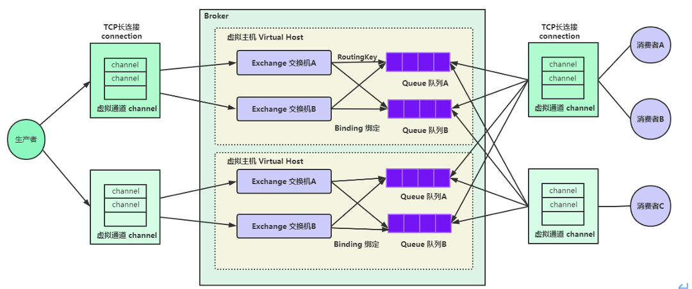
Broker 相当于MySQL服务器，Virtual Host相当于数据库，Queue相当于表，消息相当于记录。消息队列有三个核心要素： 消息生产者、消息队列、消息消费者，相关名词如下：
+ 生产者（Producer）：发送消息的应用。
+ 消费者（Consumer）：接收消息的应用。
+ 代理（Broker）：就是消息服务器，RabbitMQ Server就是Message Broker。
+ 连接（Connection）：连接RabbitMQ服务器的TCP长连接。
+ 信道（Channel）：连接中的一个虚拟通道，消息队列发送或者接收消息时，都是通过信道进行的。
+ 虚拟主机（Virtual host）：一个虚拟分组，在代码中就是一个字符串，当多个不同的用户使用同一个RabbitMQ服务时，可以划分出多个Virtual host，每个用户在自己的Virtual host创建Exchange、Queue等。
+ 交换机（Exchange）：交换机负责从生产者接收消息，并根据交换机类型分发到对应的消息队列中，起到一个路由的作用。
+ 路由键（Routing Key）：交换机根据路由键来决定消息分发到哪个队列，路由键是消息的目的地址。
+ 绑定（Binding）：绑定是队列和交换机的一个关联连接。
+ 队列（Queue）：存储消息的缓存。
+ 消息（Message）：由生产者通过RabbitMQ发送给消费者的信息。

## 六 交换机类型
+ 扇形（Fanout）交换机：投递到所有绑定的队列，不需要路由键，不需要进行路由键的匹配，相当于广播、群发。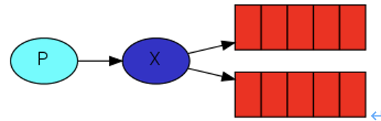
+ 直连（Direct）交换机：根据路由键精确匹配进行路由消息队列。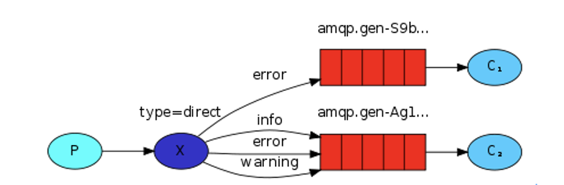
+ 主题（Topic）交换机：通配符匹配，相当于模糊匹配。#匹配多个单词，用来表示任意数量单词，\*匹配一个单词，用.隔开个单词。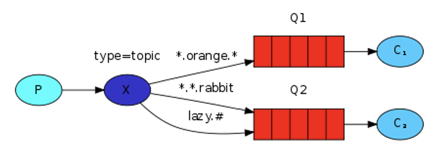
+ 头部（Headers）交换机：基于消息内容中的headers属性进行匹配。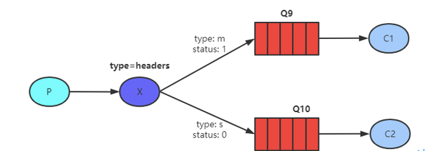

## 七 过期消息
过期消息也叫TTL消息，TTL：Time To Live 。消息的过期时间有两种设置方式：
### 7.1 设置单条消息的过期时间
单条消息的过期时间决定了在没有任何消费者消费时，消息可以存活多久。
```java
MessageProperties messageProperties = new MessageProperties();
messageProperties.setExpiration("15000");
Message message = new Message(json.getBytes(), messageProperties);
amqpTemplate.convertAndSend(RabbitConfig.DIRECT_EXCHANGE, RabbitConfig.DIRECT_ROUTINGKEY, message);
```
### 7.2 通过队列属性设置消息过期时间
队列的过期时间决定了在没有任何消费者的情况下，队列中的消息可以存活多久。
```java
@Bean
public Queue directQueue() {
    Map<String, Object> arguments = new HashMap<>();
    arguments.put("x-message-ttl", 10000);
    return new Queue(DIRECT_QUEUE, true, false, false, arguments);
}
```
注意事项：如果消息和队列都设置过期时间，则消息的TTL以两者之间较小的那个数值为准。

## 八 死信队列
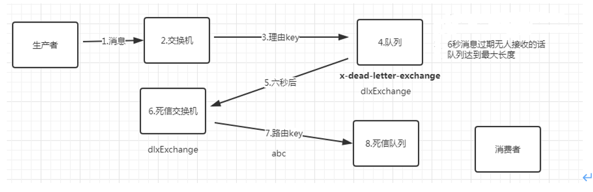如下情况下一个消息会进入DLX（Dead Letter Exchange)死信交换机：
### 8.1 消息过期
```java
MessageProperties messageProperties = new MessageProperties();
//设置此条消息的过期时间为10秒
messageProperties.setExpiration("10000");
```
### 8.2 队列过期
```java
Map<String, Object> arguments = new HashMap<>();
//指定死信交换机，通过x-dead-letter-exchange来设置
arguments.put("x-dead-letter-exchange", EXCHANGE_DLX);
//设置死信路由key，value为死信交换机和死信队列绑定的key，要一模一样
arguments.put("x-dead-letter-routing-key", BINDING_DLX_KEY);
//队列的过期时间
arguments.put("x-message-ttl",10000);
return new Queue(QUEUE_NORMAL, true, false, false, arguments);
```
### 8.3 队列达到最大长度
```java
Map<String, Object> arguments = new HashMap<String, Object>();
//设置队列的最大长度，队头的消息会被挤出变成死信
arguments.put("x-max-length", 5);
```
### 8.4 消费者拒绝消息不进行重新投递
从正常的队列接收消息，但是对消息不进行确认，并且不对消息进行重新投递，此时消息就进入死信队列。
```yml
pring:
  rabbitmq:
    listener:
      simple:
        acknowledge-mode: manual	// 启动手动确认
```

## 九 延迟队列
场景：有一个订单，15分钟内如果不支付，就把该订单设置为交易关闭，那么就不能支付了，这类实现延迟任务的场景就可以采用延迟队列来实现，当然除了延迟队列来实现，也可以有一些其他办法实现。
### 9.1 定时任务方式
#### 9.1.1 每隔3秒扫描一次数据库，查询过期的订单然后进行处理
优点：简单，容易实现。
缺点：
+ 存在延迟，如果你每隔1分钟扫一次，那么就有可能延迟1分钟。
+ 性能较差，每次都扫描数据库。
#### 9.1.2 当用户查询订单的时候，判断订单是否超时，超时了就取消
优点：对服务器而言，压力小。
缺点：
+ 用户不查询订单，将永远处于待支付状态，会对数据统计等功能造成影响。
+ 用户打开订单页面，有可能比较慢，因为要处理大量订单，用户体验少稍差。
### 9.2 JDK延迟队列（单体应用，不能使用于分布式）
DelayedQueue：无界阻塞队列，该队列只有在延迟期满的时候才能从中获取元素。
优点：实现简单，任务延迟低。
缺点：
+ 服务重启、宕机，数据丢失。
+ 只适合单机版，不适合集群。
+ 订单量大，可能内存不足而发生异常。
### 9.3 消息中间件
RabbitMQ本身不支持延迟队列，可以使用TTL结合DLX的方式来实现消息的延迟投递，即把DLX跟某个队列绑定，到了指定时间，消息过期后，就会从DLX路由到这个队列，消费者可以从这个队列取走消息。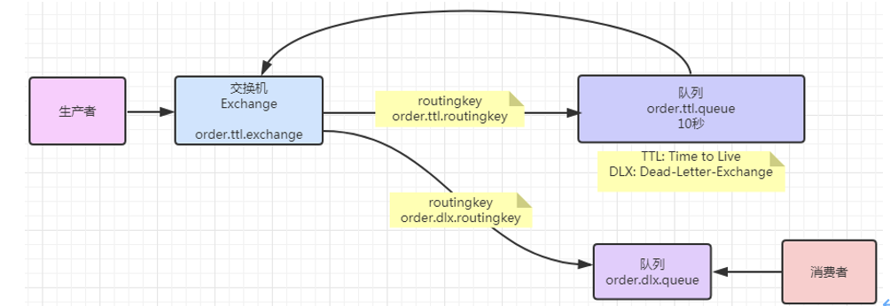
问题：如果先发送的消息，消息延迟时间长，会影响后面延迟时间短的消息的消费。
解决：不同延迟时间的消息要发到不同的队列上，同一个队列的消息，它的延迟时间应该一样。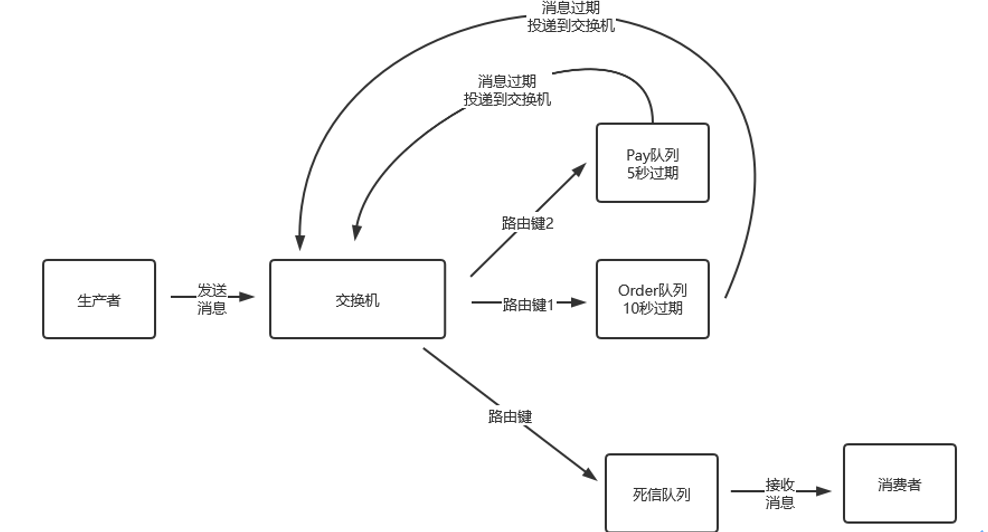

### 9.4 使用延迟插件
[rabbitmq-delayed-message-exchange](http://www.rabbitmq.com/community-plugins.html)下载地址，将插件拷贝到RabbitMQ的plugins目录下。
+ `unzip rabbitmq_delayed_message_exchange-3.10.2.ez`	// 解压
+ `rabbitmq-plugins enable rabbitmq_delayed_message_exchange`	// 开启插件
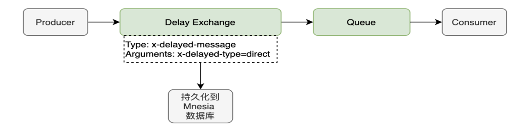
+ 消息发送后不会直接投递到队列，而是存储到 Mnesia（嵌入式数据库)，检查x-delay时间。
+ 延迟插件在RabbitMQ3.5.7及以上的版本才支持，依赖Erlang/OPT18.0及以上运行环境。
+ Mnesia是一个小型数据库，不适合于大量延迟消息的实现，解决了消息过期时间不一致出现的问题。

## 十 消息模式
rabbitmq整个消息投递的路径为：producer -> exchange -> queue -> consumer。
消息从producer 到 exchange 则会返回一个 confirmCallback。
消息从exchange –> queue 投递失败则会返回一个 returnCallback。
### 10.1 Confirm模式
#### 10.1.1 简介
消息的confirm确认机制，是指生产者投递消息后，到达了消息服务器里面的交换机，则会给生产者一个应答，生产者接收到应答，用来确定这条消息是否正常的发送到交换机中，这也是消息可靠性投递的重要保障。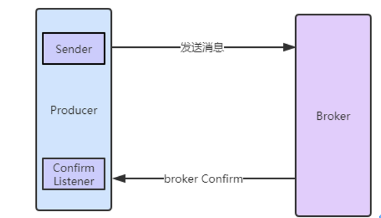
#### 10.1.2 具体代码设置
1. 配置文件。
```yml
spring.rabbitmq.publisher-confirm-type=correlated
```
2. 写一个类实现RabbitTemplate.ConfirmCallback，判断成功和失败的ack结果，可以根据具体的结果，如果ack为false，对消息进行重新发送或记录日志等处理。
3. 设置rabbitTemplate的确认回调方法。
```java
rabbitTemplate.setConfirmCallback(messageConfirmCallBack);
```
### 10.2 Return模式
#### 10.2.1 具体代码设置
1. 配置文件。
```yml
spring.rabbitmq.publisher-returns: true
```
2. 写一个类实现RabbitTemplate.ReturnsCallback。
3. 设置rabbitTemplate的确认回调方法。
```java
rabbitTemplate.setReturnsCallback(messageReturnCallBack);
```

## 十一 交换机详细属性
### 11.1 具体参数
+ Name：交换机名称，就是一个字符串。
+ Type：交换机类型，direct、topic、fanout、headers四种。
+ Durability：持久化，声明交换机是否持久化，代表交换机在服务器重启后是否还存在。
+ Auto delete：是否自动删除，曾经有队列绑定到该交换机，后来解绑了，那就会自动删除该交换机。
+ Internal：内部使用的，如果是yes，客户端无法直接发消息到此交换机，它只能用于交换机与交换机的绑定。
+ Arguments：只有一个取值alternate-exchange，表示备用交换机。
### 11.2 备用交换机
当消息经过交换机准备路由给队列的时候，发现没有对应的队列可以投递信息，在rabbitmq中会默认丢弃消息，如果我们想要监测哪些消息被投递到没有对应的队列，我们可以用备用交换机来实现，可以接收备用交换机的消息，然后记录日志或发送报警信息。

## 十二 队列详细属性
### 12.1 具体参数
+ Type：队列类型。
+ Name：队列名称，就是一个字符串，随便一个字符串就可以。
+ Durability：声明队列是否持久化，代表队列在服务器重启后是否还存在。
+ Auto delete：是否自动删除，如果为true，当没有消费者连接到这个队列的时候，队列会自动删除。
+ Exclusive：exclusive属性的队列只对首次声明它的连接可见，并且在连接断开时自动删除。基本上不设置它，设置成false。
+ Arguments：队列的其他属性，例如指定DLX（死信交换机等）。
	1. x-expires：Number，当队列在指定的时间未被访问，则队列将被自动删除。
	2. x-message-ttl：Number，发布的消息在队列中存在多长时间后被取消（单位毫秒）。
	3. x-overflow：String，设置队列溢出行为，当达到队列的最大长度时，消息会发生什么，有效值为Drop Head或Reject Publish。
	4. x-max-length：Number，队列所能容下消息的最大长度，当超出长度后，新消息将会覆盖最前面的消息，类似于Redis的LRU算法。
	5. x-single-active-consumer：默认为false，激活单一的消费者，也就是该队列只能有一个消息者消费消息。
	6. x-max-length-bytes：Number，限定队列的最大占用空间，当超出后也使用类似于Redis的LRU算法。
	7. x-dead-letter-exchange：String，指定队列关联的死信交换机，有时候我们希望当队列的消息达到上限后溢出的消息不会被删除掉，而是走到另一个队列中保存起来。
	8. x-dead-letter-routing-key：String，指定死信交换机的路由键，一般和7一起定义。
	9. x-max-priority：Number，如果将一个队列加上优先级参数，那么该队列为优先级队列。
	10. x-queue-mode：String，队列类型x-queue-mode=lazy懒队列，在磁盘上尽可能多地保留消息以减少RAM使用，如果未设置，则队列将保留内存缓存以尽可能快地传递消息。
	11. x-queue-master-locator：String，在集群模式下设置队列分配到的主节点位置信息；每个queue都有一个master节点，所有对于queue的操作都是事先在master上完成，之后在slave上进行相同的操作；每个不同的queue可以坐落在不同的集群节点上，这些queue如果配置了镜像队列，那么会有一个master和多个slave。基本上所有的操作都落在master上，那么如果这些queues的master都落在个别的服务节点上，而其他的节点又很空闲，这样就无法做到负载均衡，那么势必会影响性能。关于master queue host 的分配有几种策略：（1）min-masters：选择master queue数最少的那个服务节点host；（2）client-local：选择与client相连接的那个服务节点host；（3）random：随机分配；

## 十三 消息可靠性投递
消息的可靠性投递就是要保证消息投递过程中每一个环节都要成功，那么这肯定会牺牲一些性能，性能与可靠性是无法兼得的。如果业务实时一致性要求不是特别高的场景，可以牺牲一些可靠性来换取性能。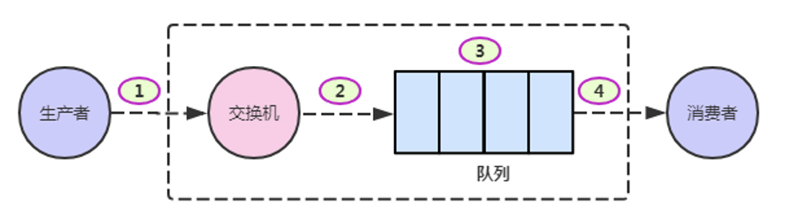
①代表消息从生产者发送到Exchange；
②代表消息从Exchange路由到Queue； 
③代表消息在Queue中存储；
④代表消费者监听Queue并消费消息；
### 13.1 确保消息发送到交换机上
+ Confirm模式。
+ Transaction模式。
### 13.2 确保消息路由到正确的队列
+ Return模式。
+ 备用交换机。
### 13.3 确保消息在队列正确地存储
+ 队列持久化。
+ 交换机持久化。
+ 消息持久化。
+ 集群、镜像队列。
### 13.4 确保消息从队列正确地投递到消费者
+ 消息消费时的手动ack确认机制。
### 13.5 消息的幂等性
+ 消息消费时的幂等性（消息不被重复消费），同一个消息，第一次接收，正常处理业务，如果该消息第二次再接收，那就不能再处理业务，否则就处理重复了。
+ 幂等性是指对于一个资源，不管你请求一次还是请求多次，对该资源本身造成的影响应该是相同的，不能因为重复的请求而对该资源重复造成影响。

问题：如何避免消息的重复消费问题？
解决：唯一Id+Redis
## 十四 集群
RabbitMQ的集群分两种模式：
+ 默认集群模式。
+ 镜像集群模式。

RabbitMQ集群中所有的节点被归为两类：
+ 磁盘节点：磁盘节点会把集群的所有信息（比如交换机、绑定、队列等信息）持久化到磁盘中。
+ 内存节点：将这些信息保存到内存中，如果该节点宕机或重启，内存节点的数据会全部丢失。
### 14.1 默认集群模式
默认集群模式也叫普通集群模式或者内置集群模式，RabbitMQ默认集群模式，只会把交换机、队列、虚拟主机等元数据信息在各个节点同步，而具体队列中的消息内容不会在各个节点中同步。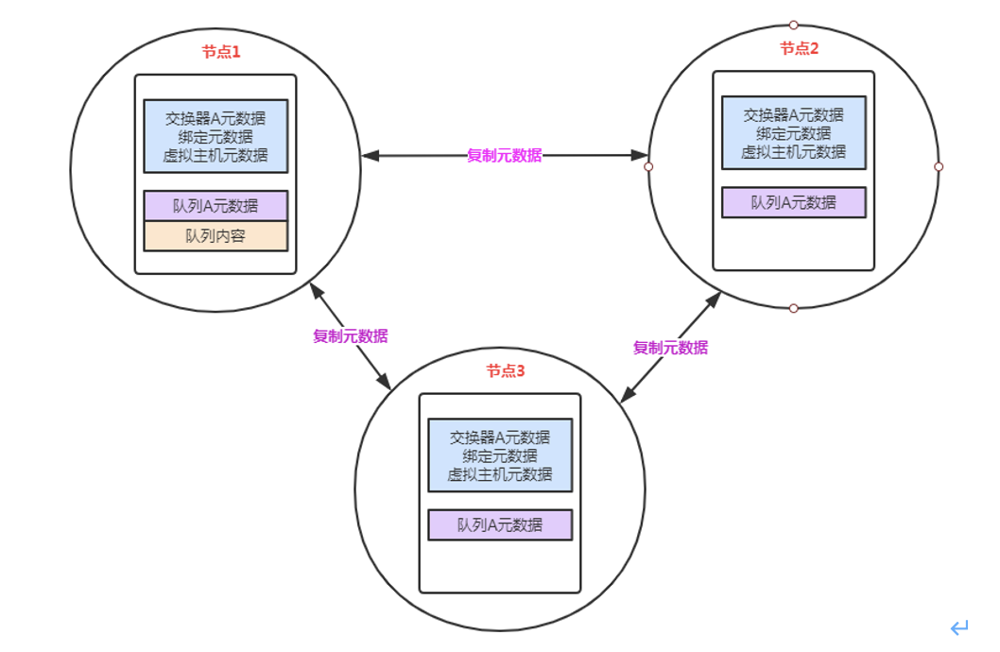
元数据：
+ 队列元数据：队列名称和属性。
+ 交换机元数据：交换器名称、类型和属性。
+ 绑定元数据：交换器和队列的绑定列表。
+ vhost元数据：vhost内的相关属性，如安全属性等。

当用户访问其中任何一个RabbitMQ节点时，查询到的queue、exchange、vhost等信息都是相同的。但集群中队列的具体信息数据只在队列的拥有者节点保存，其他节点只知道队列的元数据和指向该节点的指针，所以其他节点接收到不属于该节点队列的消息时会将该消息传递给该队列的拥有者节点上。

问题：如果客户端相连的是节点2或者节点3 （队列1数据不在该节点上），那么这种情况会是怎么样呢？
解答：在发送消息过程中这两个节点主要起了一个路由转发作用，根据这两个节点上的元数据转发至节点1上，最终发送的消息还是会存储至节点1的队列1上。同样，如果消息消费者所连接的节点2或者节点3，那这两个节点也会作为路由节点起到转发作用，将会从节点1的队列1中获取消息进行消费。
### 14.2 构建集群前准备
#### 14.2.1 从已经安装好rabbitmq的机器clone三台机器
#### 14.2.2 重新设置三台机器的mac地址
#### 14.2.3 启动三台机器
#### 14.2.4 修改三台机器的/etc/hosts文件
#### 14.2.5 三台机器均重启网络
#### 14.2.6 三台机器的防火墙关闭
### 14.3 构建集群
+ `rabbitmqctl cluster_status`	// 查看集群状态
+ `rabbitmqctl join_cluster rabbit@Master --ram`	// 加入集群，成为内存节点 
### 14.4 镜像集群模式
镜像模式是基于默认集群模式加上一定的配置得来的，在默认模式下的RabbitMQ集群，它会把所有节点的交换机、绑定、队列的元数据进行复制确保所有节点都有一份相同的元数据信息，但是队列数据分为两种：一种是队列的元数据信息（比如队列的最大容量，队列的名称等配置信息），另一种是队列里面的消息。镜像模式，则是把所有的队列数据完全同步，包括元数据信息和消息数据信息，当然这对性能肯定会有一定影响，当对数据可靠性要求较高时，可以使用镜像模式。