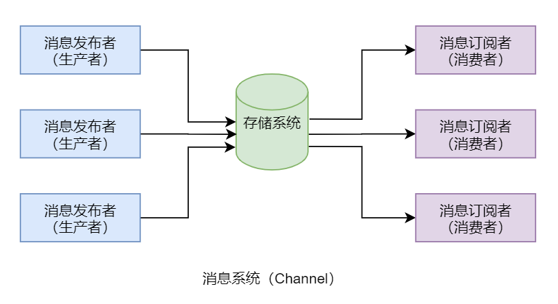

# Redis
>1. [动力节点2022](https://www.bilibili.com/video/BV1U24y1y7jF?p=3&spm_id_from=pageDriver&vd_source=e5de1dabc977707311263a4bc0f609cc "redis")

## 一 基本概述
### 1.1 NoSQL
NoSQL泛指非关系型的数据库，其产生就是为了解决大规模数据集合、多重数据种类带来的挑战，特别是大数据应用难题。
#### 1.1.1 键值存储数据库
就像map一样，redis就是典型代表。
#### 1.1.2 列存储数据库
关系型数据库就是典型的行存储数据库，其存在的问题是，按行存储在物理层占用的连续的存储空间，不适合存储海量数据。而按列存储则可实现分布式存储，适合海量存储，典型代表是HBase。
#### 1.1.3 文档型数据库
其为NoSQL于关系型数据库的结合，典型代表是MongoDB。
#### 1.1.4 图形数据库
用于存放一个节点关系的数据库，例如描述不同人之间的关系，代表是Noe4J。
### 1.2 Redis的用途
生产环境用的最多的场景就是做数据缓存，即用户从持久层查出的数据先写入到redis中，后续无论哪个用户再访问该数据，就直接读取redis中的数据，这样降低了持久层的压力。缓存一般可以分为实时同步缓存与阶段性同步缓存。前者是指持久层的数据更新之后，立即清除放入redis中的相关数据，下次访问时，必须先从持久层查询到最新的数据，再放入到redis中进行缓存；后者允许在一段时间内，redis中的数据与持久层的数据不一致，这个时间就是缓存数据的过期时间。

### 1.3 Redis的特性
+ 性能极高：redis读的速度可以达到11w次/s，写的速度可以达到8w次/s。因为redis所有操作都是在内存中发生，而且用c语言开发的，源码非常精细。
+ 简单稳定：redis源码很少，早期只有2w行左右，从3.0版本增加了集群之后，变成5w行左右。
+ 持久化：redis内存中的数据可以进行持久化，有两种方式-RDB与AOF。
+ 高可用集群：redis提供了高可用的主从集群功能，可以确保系统的安全性。
+ 丰富的数据类型：支持字符串、链表、集合、有序集合、哈希类型等。
+ 强大的功能：提供了数据过期功能、发布/订阅功能、简单事务功能、还支持Lua脚本拓展功能。
+ 客户端语言广泛：提供了简单的TCP通信协议，编程语言可以很方便的接入redis。
+ 支持ACL权限控制：从6.0开始引入了ACL模块，可以为不同用户定制不同的用户权限。
+ 支持多线程IO模型：从6.0开始支持多线程模型。
### 1.4 Redis的IO模型
#### 1.4.1 单线程模型
优点：可维护性高，性能高，不存在并发读写情况，所以也就不存在执行顺序的不确定性。不存在线程切换开销，不存在死锁问题，不存在为了数据安全而进行的加锁/解锁。
缺点：性能会受到影响，由于单线程只能使用一个处理器，所以会形成处理器浪费。
#### 1.4.2 多线程模型
优点：结合了单线程与多线程的优点，避开了它们的不足。
缺点：没有显著不足，但其并非真正意义上的多线程，因为真正处理任务的线程依然是单线程。

## 二 安装与配置
### 2.1 Redis的安装
#### 2.1.1 安装虚拟机
#### 2.1.2 安装前的准备工作
+ `yum -y install gcc gcc-c++`	// 安装gcc
+ `tar -xvzf redis.tar.gz`	// 解压redis
#### 2.1.3 安装Redis
+ `make`	// 在redis目录执行make
+ `make install` 	// make完之后执行，在/usr/local/bin可以看到相关命令
#### 2.1.4 启动与停止
+ `redis-server`	// 启动
+ `redis-cli`	// 进入客户端
+ `quit`	// 退出客户端
+ `nohup redis-server &`	// 后台启动，会产生nohup.out文件
+ `redis-cli shutdown`	// 停止
+ `vim redis.conf; redis-server ConfigPath`	// 修改daemonize为yes，以守护进程方式启动，启动时传入配置文件路径
### 2.2 连接前的配置
+ `#bind:127.0.0.1` 	// 修改配置文件，注释掉bind，允许远程访问
+ `protected-mode no`	// 关闭保护模式
+ `requirepass Password`	// 设置密码
+ `auth Password`	// 进入客户端获得权限
+ `rename-command Command "NewName"`	// 重命名命令
+ `redis-cli -h Host -p Port -a Password`	// 远程连接
### 2.3 Redis配置文件详解
+ `include ConfigPath`	// 写到最后一行，用来添加其他配置文件，会覆盖之前相同的属性
+ `timeout Time` // 设置某个时间内不进行操作就断开连接
+ `tcp-keepalive Time`	// 每隔该时间检测一次客户端，两次检测后不存在才会断开，timeout属性为0时才有用
+ `tcp-backlog Length`	// tcp连接的队列长度，主要用于解决高并发下客户端慢连接问题。linux2.2之前，backlog队列中有已完成三次握手和未完成三次握手的两种状态；2.2之后，backlog就是已完成三次握手的队列。tcp中的backlog队列在linux中由参数somaxconn来决定，所以，在redis中该队列的长度由配置文件设置与somaxconn来共同决定，取最小值
+ `cat /proc/sys/net/core/somaxconn`	// 查看linux中somaxconn
+ `vim /etc/sysctl.conf`	// 设置net.core.somaxconn=2048，修改somaxconn的值
+ `sysctl -p`	// 使修改生效
+ `pidfile PidFile`	// 指定redis运行时pid写入的文件，不配置的话，使用前台方式启动则不会产生pid文件
+ `logfile LogFile`	// 指定日志文件，如果设置为空串，则将日志记录到显示器，如果是守护进程模式，则发送到设备/dev/null（空设备）
+ `database Num`	// 设置数据库的数量，编号为0～Num-1
+ `maxclients Num`	// 设置可并发处理的客户端连接数，如果达到了最大值，则会拒绝新的连接，该值不能超过linux系统支持的可打开的文件描述符最大数量阈值
+ `ulimit -n`	// 查看阈值，可以通过修改/etc/security/limits.conf文件来设置
+ `maxmemory Bytes`	// 将内存限制为指定的字节数，当达到限制时，根据maxmemory-policy来尝试删除符合条件的key
+ `maxmemory-policy Policy`	// 选择删除策略，当没有符合相应策略的内容要删除时，在执行写入命令时会给出error响应
+ `maxmemory-samples`	// 用于指定要删除的key的样本数量，样本选择采用的是LRU算法，从样本中选择要删除的key，采用的是maxmemory-policy指定的策略
+ `maxmemory-eviction-tenacity Size`	// 对选择出来的key，什么时候删除，数值越小删的越快
+ `lscpu`	// 查看系统cpu数量
+ `io-thread Num`	// 指定要启用多线程模型时，使用的线程的数量

## 三 Redis命令
### 3.1 基本命令
+ `ping`	// 看到pong响应，说明该客户端与Redis的连接正常
+ `set Key Value`	// 设置键值对
+ `get Key`	// 获取Key对应的值
+ `select DatabaseId`	// 选择数据库
+ `dbsize`	// 查看数据库大小
+ `flushdb`	// 删除当前数据库数据
+ `flushall`	// 删除所有数据库数据
### 3.2 Key操作命令
Redis中存储的数据整体是一个Map，其Key为String类型，而Value则可以是String、Hash、List、Set等类型。
+ `keys Pattern`	//  按正则匹配查找Key，速度快，在大的数据库中使用可能会阻塞服务器，所以生产环境一般不使用
+ `exists Key`	// 存在返回1，否则0
+ `del Key...`	//  删除指定的一个或多个Key，会忽略不存在的Key，返回删除的数量
+ `rename Key NewKey`	// 将指定Key改名，当Key和NewKey相同，或者Key不存在，会返回一个错误，当NewKey已经存在时，rename会覆盖Key的值
+ `move Key DatabasesId`	// 将当前数据库的Key移动到给定数据库，如果存在同名Key或者Key不存在，则move没有效果
+ `type Key`	// 返回Key所存储的类型
+ `expire Key Seconds`	// 为Key设置生存时间，过期会被自动删除，rename不会改变Key生存时间，设置成功返回1
+ `pexpire Key Milliseconds`	// 毫秒单位
+ `ttl Key`	// 查看Key剩余的生存时间，Key不存在返回-2，Key存在但没有设置生存时间返回-1
+ `pttl Key`	// 毫秒单位
+ `persist Key`	// 去除Key的生存时间 ，若Key不存在或Key没有设置生存时间，返回0
+ `randomkey`	// 随机返回一个Key
+ `scan Cursor (match Pattern) count Num`	// 迭代数据库中的Key，Cursor为迭代开始的游标
### 3.3 String类型Value操作命令
Redis存储数据的Value可以是一个String类型数据。String类型的Value是Redis中最基本，最常见的类型。String类型的Value中可以存放任意数据，包括数值型，甚至是二进制的图片、音频、视频、序列化对象等。一个String类型的Value最大是512M大小。
+ `setex Key Seconds Value`	// 设置键值对时指定生存时间，如果Key已经存在，则覆写旧值
+ `psetex Key Milliseconds Value`	// 毫秒单位
+ `setnx Key Value`	// 不存在时才设置键值对
+ `getset Key Value`	// 	将Key的值设置为Value，并且返回旧值
+ `mset [Key Value]...`	// 同时设置一个或多个键值对，对存在的Key会用新值覆盖
+ `msetnx [Key Value]...`	// 只有在Key都不存在的时候才会进行设置
+ `mget Key...`	// 一次获取多个Key
+ `append Key Value`	// 如果Key存在并且是一个字符串，则把Value追加到原来值的末尾，如果不存在，则设置键值对
+ `incr Key`	// 将Key中存储的数字值加1，如果Key不存在，那么Key的值会被初始化为0，如果Key的值不能表示为数字，那么返回错误
+ `decr Key`	// 将Key中存储的数字值减1
+ `incrby Key Increment`	// 将Key中存储的数字增加Increment，只能是整数
+ `decrby Key Increment`	// 将Key中存储的数字减少Increment，只能是整数
+ `incrbyfloat Key Increment`	// 可以是浮点数的增量
+ `strlen Key`	// 返回Key所存储的字符串值的长度
+ `getrange Key Start End`	// 返回Key中存储的字符串的子串，闭区间，支持负偏移量，-1表示最后一个字符，以此类推
+ `setrange Key Offset Value`	// 用Value替换给定Key所储存的字符串值，从偏移量Offset开始

应用场景：
+ 数据缓存：Redis作为数据缓存层，MySQL作为数据存储层。应用服务器首先从Redis中获取数据，如果缓存层中没有，则从MySQL中获取后先存入缓存层再返回给应用服务器。
+ 计数器：在Redis中写入一个value为数值型的key作为平台计数器、视频播放计数器等。每个有效客户端访问一次，或视频每播放一次，都是直接修改Redis中的计数器，然后再以异步方式持久化到其它数据源中，例如持久化到MySQL。
+ 共享Session：对于一个分布式应用系统，如果将类似用户登录信息这样的Session 数据保存在提供登录服务的服务器中，那么如果用户再次提交像收藏、支付等请求时可能会出现问题：在提供收藏、支付等服务的服务器中并没有该用户的Session数据，从而导致该用户需要重新登录。对于用户来说，这是不能接受的。此时，可以将系统中所有用户的Session数据全部保存到Redis中，用户在提交新的请求后，系统先从Redis中查找相应的Session数据，如果存在，则再进行相关操作，否则跳转到登录页面。这样就不会引发“重新登录”问题。
+ 限速器：现在很多平台为了防止DoS攻击，一般都会限制一个IP不能在一秒内访问超过n次。而Redis可以结合key的过期时间与incr命令来完成限速功能，充当限速器。
### 3.4 Hash类型Value操作命令
Redis存储数据的Value可以是一个Hash类型。Hash类型也称为Hash表、字典等。Hash表就是一个映射表Map，也是由键值对构成，为了与整体的Key进行区分，这里的键称为Field，值称为Value。注意，Redis的Hash表中的Field-Value对均为String类型。
+ `hset Key Field Value`	// 将Key所存储的哈希表中的Field的值设为Value
+ `hget Key Field`	// 返回Key所存储的哈希表中的Field的值
+ `hmset Key [Field Value]...`	//  创建多个Field-Value对
+  `hmget Key Field...`	// 获取多个Field的值
+  `hgetall Key`	// 返回所有Field-Value对
+  `hsetnx Key Field Value`	// 将Key所存储的哈希表中的Field的值设为Value，当且仅当域Field不存在
+  `hdel Key Field...`	// 删除一个或多个Field
+  `hexists Key Field`	// 查看Field是否存在
+  `hincrby Key Field Increment`	// 为Field的值增加Increment，整数
+  `hincrbyfloat Key Field Increment`	// 可以为小数
+  `hkeys Key`	// 返回所有Field
+  `hvals Key`	// 返回所有Field的值
+  `hlen Key`	// 返回Field的数量
+  `hstrlen Key Field`	// 返回Field所指的字符串长度

应用场景：
+ Hash型Value非常适合存储对象数据。Key为对象名称，Value为描述对象属性的Map，对对象属性的修改在Redis中就可直接完成。其不像String型Value存储对象，那个对象是序列化过的，例如序列化为JSON串，对对象属性值的修改需要先反序列化为对象后再修改，修改后再序列化为JSON串后写入到Redis。
### 3.5 List类型Value操作命令
Redis存储数据的Value可以是一个String列表类型数据。即该列表中的每个元素均为String类型数据。列表中的数据会按照插入顺序进行排序。不过，该列表的底层实际是一个无头节点的双向链表，所以对列表表头与表尾的操作性能较高，但对中间元素的插入与删除的操作的性能相对较差。
+ `lpush Key Value...`	// 各个Value会按从左到右的顺序依次插入到表头
+ `rpush Key Value`	// 各个Value会按从左到右的顺序依次插入到表尾
+ `llen Key`	// 返回列表长度
+ `lindex Key Index`	// 返回列表Key中，下标为Index的元素。列表从0开始计数
+ `lset Key Index Value`	// 将列表Key下标为Index的元素的值设置为Value
+ `lrange Key Start Stop`	// 返回列表Key中指定闭区间内的元素
+ `lpushx Key Value`	// 将值Value插入到列表Key的表头
+ `rpush Key Value`	// 将值Value插入到列表Key的表尾
+ `linsert Key before|after Pivot Value`	// 将值Value插入到列表Key当中，位于元素Pivot之前或之后
+ `lpop Key [Count]`	// 从列表Key的表头移除Count个元素，默认为1
+ `rpop Key [Count]`	// 从列表Key的表尾移除Count个元素，默认为1
+ `blpop Key... Timeout`	// 当给定列表内没有任何元素可供弹出的时候，连接将被blpop/brpop命令阻塞，直到等待Timeout超时或发现可弹出元素为止。当给定多个 Key参数时，按参数Key的先后顺序依次检查各个列表，弹出第一个非空列表的头元素。Timeout为阻塞时长，单位为秒，其值若为0，则表示只要没有可弹出元素，则一直阻塞。
+ `brpop Key... Timeout`	// 同上
+ `rpoplpush Source Destination`	// 将列表Source中的尾元素弹出，并返回给客户端；将Source弹出的元素插入到列表Destination的头部
+ `brpoplpush Source Destination Timeout`	// brpoplpush是rpoplpush的阻塞版本，当给定列表Source不为空时，brpoplpush的表现和rpoplpush一样。当列表Source为空时，brpoplpush命令将阻塞连接，直到等待超时，或有另一个客户端对Source执行lpush或rpush命令为止。Timeout为阻塞时长，单位为秒，其值若为0，则表示只要没有可弹出元素，则一直阻塞
+ `lrem Key Count Value`	// 根据参数Count的值，移除列表中与参数Value相等的Count个元素，大于0从表头开始搜索，小于0从表尾开始搜索，等于0移除所有
+ `ltrim Key Start Stop`	// 让列表只保留指定区间内的元素，不在指定区间之内的元素都将被删除

应用场景：
+ 栈：通过lpush + lpop可以实现栈数据结构效果。通过lpush从列表左侧插入数据，通过lpop从列表左侧取出数据。当然，通过rpush + rpop也可以实现相同效果，只不过操作的是列表右侧。
+ 队列：通过lpush + rpop可以实现队列数据结构效果。通过lpush从列表左侧插入数据，通过rpop从列表右侧取出数据。当然，通过rpush + lpop也可以实现相同效果，只不过操作的方向正好相反。
+ 阻塞式消息队列：通过lpush + brpop可以实现阻塞式消息队列效果。作为消息生产者的客户端使用lpush从列表左侧插入数据，作为消息消费者的多个客户端使用brpop阻塞式“抢占”列表尾部数据进行消费，保证了消费的负载均衡与高可用性。brpop的Timeout 设置为0，表示只要没有数据可弹出，就永久阻塞。
+ 动态有限集合：通过lpush + ltrim可以实现有限集合。通过lpush从列表左侧向列表中添加数据，通过ltrim保持集合的动态有限性。像企业的末位淘汰、学校的重点班等动态管理，都可通过这种动态有限集合来实现。当然，通过rpush + ltrim也可以实现相同效果，只不过操作的方向正好相反。
### 3.6 Set类型Value操作命令
Redis存储数据的Value可以是一个Set集合，且集合中的每一个元素均String类型。Set与List非常相似，但不同之处是Set中的元素具有无序性与不可重复性，而List则具有有序性与可重复性。
+ `sadd Key Member...`	// 将一个或多个元素加入集合
+ `smembers Key`	// 返回集合所有元素
+ `scard Key`	// 返回集合的长度
+ `sismember Key Member`	// 判断Member是否是集合的成员
+ `smove Source Destination Member`	// 将Member元素从Source集合移动到Destination集合
+ `srem Key Member...`	// 移除集合中的一个或多个Member元素
+ `srandmember Key [Count]`	// 返回集合中的Count个随机元素。count默认值为1
+ `spop Key [Count]`	// 移除并返回集合中的Count个随机元素。Count必须为正数，且默认值为1
+ `sdiff Key...`	// 返回第一个集合与其它集合之间的差集
+ `sdiffstore Destination Key...`	// 	同上，还能将差集存储到指定的集合 Destination中
+ `sinter Key...`	// 返回多个集合间的交集
+ `sinterstore Destination Key...`	// 	同上，还能将交集存储到指定的集合 Destination中
+ `sunion Key...`	// 返回多个集合间的并集
+ `sunionstore Destination Key...`	// 同上，还能将并集存储到指定的集合 Destination中

应用场景：
+ 动态黑名单：例如某服务器中要设置用于访问控制的黑名单。如果直接将黑名单写入服务器的配置文件，那么存在的问题是，无法动态修改黑名单。此时可以将黑名单直接写入Redis，只要有客户端来访问服务器，服务器在获取到客户端IP后先从Redis的黑名单中查看是否存在该IP，如果存在，则拒绝访问，否则访问通过。
+ 有限随机数：有限随机数是指返回的随机数是基于某一集合范围内的随机数，例如抽奖、随机选人。通过spop或srandmember可以实现从指定集合中随机选出元素。
+ 用户画像：社交平台、电商平台等各种需要用户注册登录的平台，会根据用户提供的资料与用户使用习惯，为每个用户进行画像，即为每个用户定义很多可以反映该用户特征的标签，这些标签就可以使用sadd添加到该用户对应的集合中。这些标签具有无序、不重复特征。同时平台还可以使用sinter或sinterstore根据用户画像间的交集进行好友推荐、商品推荐、客户推荐等。
### 3.7 有序Set类型Value操作命令
Redis存储数据的Value可以是一个有序Set，这个有序Set中的每个元素均为String类型。有序Set与Set的不同之处是，有序Set中的每一个元素都有一个分值Score，Redis会根据Score的值对集合进行由小到大的排序。其与Set集合要求相同，元素不能重复，但元素的Score可以重复。由于该类型的所有命令均是字母z开头，所以该Set也称为ZSet。
+ `zadd Key [Score Member]...`	// 将一个或多个Member元素及其Score值加入到有序集中的适当位置
+ `zrange Key Start Stop [withscores]`	// 返回有序集中，指定区间内的成员。按Score值递增排序。具有相同Score值的成员按字典序排列。可以通过使用withscores选项，来让成员和它的Score值一并返回
+ `zrevrange Key Start Stop [withscores]`		// 同上，顺序相反
+ `zrangebyscore Key Min Max [withscores] [limit offset count]`	// 返回有序集中，所有Score值介于Min和Max之间的成员。有序集成员按Score值递增排列。具有相同Score值的成员按字典序排列。limit参数指定返回结果的数量及区间，注意当offset很大时，定位offset的操作可能需要遍历整 个有序集，此过程效率可能会较低
+  `zrevrangebyscore Key Max Min [withscores] [limit offset count]`	// 同上，顺序相反
+ `zcard Key`	// 返回集合的长度
+ `zcount Key Min Max`	// 返回有序集中，Score值在Min和Max之间的成员的数量。闭区间
+ `zscore Key Member`	// 返回有序集中，成员Member的Score值
+ `zincrby Key Increment Member`	// 为有序集的成员Member的Score值加上增量Increment。Increment值可以是整数值或双精度浮点数
+ `zrank Key Member`	// 返回有序集中成员Member的排名。按Score值递增排序
+ `zrevrank Key Member`	// 同上，递减
+ `zrem Key Member...`	// 移除有序集中的一个或多个成员
+ `zremrangebyrank Key Start Stop`	// 移除有序集中，指定排名区间内的所有成员
+ `zremrangebyscore Key Min Max`	// 移除有序集中，所有Score值介于Min和Max之间的成员。闭区间
+ `zrangebylex Key Min Max [limit offset count]`	// 适用于集合中所有成员都具有相同分值的情况。当有序集合的所有成员都具有相同的分值时，有序集合的元素会根据成员的字典序来进行排序。即这个命令返回给定集合中元素值介于Min和Max之间的成员。如果有序集合里面的成员带有不同的分值，那么命令的执行结果与zrange效果相同
+ `zlexcount Key Min Max`	// 适用于集合中所有成员都具有相同分值的情况。该命令返回该集合中元素值本身介于Min和Max范围内的元素数量
+ `zremrangebylex Key Min Max`	// 适用于集合中所有成员都具有相同分值的情况。该命令会移除该集合元素值本身介于Min和Max范围内的所有元素

应用场景：
+ 有序Set最为典型的应用场景就是排行榜，例如音乐、视频平台中根据播放量进行排序的排行榜；电商平台根据用户评价或销售量进行排序的排行榜等。将播放量作为Score，将作品Id作为Member，将用户评价积分或销售量作为Score，将商家Id作为Member。使用zincrby增加排序Score，使用zrevrange获取Top前几名，使用zrevrank查询当前排名，使用zscore查询当前排序Score等。
### 3.8 benchmark测试工具
+ `redis-benchmark (-h -p -c -n -d -t -q)`	// h指定ip；p指定端口；c指定模拟有客户端的数量，默认为50；n指定客户端发出的请求数，默认为100000；d指定get、set命令时其操作的value的数据长度，默认3字节；t指定要测试的命令，多个命令使用逗号分隔，不能有空格；q指定仅给出总述性报告
### 3.9 简单动态字符串SDS
#### 3.9.1 SDS简介
无论是Redis的Key还是Value，其基础数据类型都是字符串。例如，Hash型Value的Field与Value的类型、List型、Set型、ZSet型Value的元素的类型等都是字符串。虽然 Redis是使用标准C语言开发的，但并没有直接使用C语言中传统的字符串表示，而是自定义了一 种字符串。这种字符串本身的结构比较简单，但功能却非常强大，称为简单动态字符串，Simple Dynamic String，简称SDS。

注意，Redis中的所有字符串并不都是 SDS，也会出现C字符串。C字符串只会出现在字符串“字面常量”中，并且该字符串不可能发生变更。

#### 3.9.2 SDS结构
SDS不同于C字符串。C字符串本身是一个以双引号括起来，以空字符’\0’结尾的字符序列。但SDS是一个结构体，定义在Redis安装目录下的src/sds.h中：
```c
struct sdshdr {
		// 字节数组, 用于保存字符串 
		char buf[]; 
		// buf[]中已使用字节数量, 称为SDS的长度 
		int len; 
		// buf[]中尚未使用的字节数量 
		int free;
}
```
#### 3.9.3 SDS的优势
+ 防止”字符串长度获取“性能瓶颈：对于C字符串，若要获取其长度，则必须要通过遍历整个字符串才可获取到的。对于超长字符串的遍历，会成为系统的性能瓶颈。由于SDS结构体中直接就存放着字符串的长度数据，所以对于获取字符串长度需要消耗的系统性能，与字符串本身长度是无关的，不会成为Redis的性能瓶颈。
+ 保障二进制安全：C字符串中只能包含符合某种编码格式的字符，例如ASCII、UTF-8等，并且除了字符串末尾外，其它位置是不能包含空字符’\0’的，否则该字符串就会被程序误解为提前结束。而在图片、音频、视频、压缩文件、office文件等二进制数据中以空字符’\0’作为分隔符的情况是很常见的。故而在C字符串中是不能保存像图片、音频、视频、压缩文件、office文件等二进制数据的。但SDS不是以空字符’\0’作为字符串结束标志的，其是通过len属性来判断字符串是否结束的。所以，对于程序处理SDS中的字符串数据，无需对数据做任何限制、过滤、假设，只需读取即可。数据写入的是什么，读到的就是什么。
+ 减少内存再分配次数：SDS采用了空间预分配策略与惰性空间释放策略来避免内存再分配问题。空间预分配策略是指，每次SDS进行空间扩展时，程序不但为其分配所需的空间，还会为其分配额外的未使用空间，以减少内存再分配次数。而额外分配的未使用空间大小取决于空间扩展后SDS的len属性值：
	+ 如果len属性值小于1M，那么分配的未使用空间free的大小与len属性值相同。
	+ 如果len属性值大于等于1M ，那么分配的未使用空间free的大小固定是1M。

	SDS对于空间释放采用的是惰性空间释放策略。该策略是指SDS字符串长度如果缩短，那么多出的未使用空间将暂时不释放，而是增加到free中。以使后期扩展SDS时减少内存再分配次数。如果要释放SDS的未使用空间，则可通过sdsRemoveFreeSpace()函数来释放。
+ 兼容C函数：Redis中提供了很多的SDS的API，以方便用户对Redis进行二次开发。为了能够兼容C函数，SDS的底层数组buf中的字符串仍以空字符’\0’结尾。
#### 3.9.4 常用的SDS函数
|函数|功能描述|
|:--:|:--:|
|sdsnew()|使用指定的C字符串创建一个SDS|
|sdsempty()|创建一个不包含任何字符串数据的SDS|
|sdsdup()|创建一个指定SDS的副本|
|sdsfree()|释放指定的SDS|
|sdsclear()|清空指定SDS的字符串内容|
|sdslen()|获取指定SDS的已使用空间len值|
|sdsavail()|获取指定SDS的未使用空间free值|
|sdsMakeRoomFor()|使指定的SDS的free空间增加指定的大小|
|sdsRemoveFreeSpace()|释放指定SDS的free空间|
|sdscat()|将指定的C字符串拼接到指定SDS字符串末尾|
|sdscatsds()|将指定的SDS的字符串拼接到另一个指定SDS字符串末尾|
|sdscpy()|将指定的C字符串复制到指定的SDS中，覆盖原SDS字符串内容|
|sdsgrouzero()|扩展SDS字符串到指定长度，这个扩展是使用空字符’\0’填充|
|sdsrange()|截取指定SDS中指定范围内的字符串|
|sdstrim()|在指定SDS中删除所有指定C字符串中出现的所有字符|
|sdsemp()|对比两个给定的SDS字符串是否相同|
|sdstolow()|将指定SDS字符串中的所有字母变为小写|
|sdstoupper()|将指定SDS字符串中的所有字母变为大写|
### 3.10 集合的底层实现原理
Redis中对于Set类型的底层实现，直接采用了hashTable。但对于Hash、ZSet、List集合的底层实现进行了特殊的设计，使其保证了Redis的高性能。
#### 3.10.1 两种实现的选择
对于Hash与ZSet集合，其底层的实现实际有两种：压缩列表zipList，与跳跃列表skipList。这两种实现对于用户来说是透明的，但用户写入不同的数据，系统会自动使用不同的实现。只有同时满足配置文件redis.conf中相关集合元素数量阈值与元素大小阈值两个条件，使用的就是压缩列表zipList，只要有一个条件不满足使用的就是跳跃列表skipList。例如，对于ZSet集合中这两个条件如下：
+ 集合元素个数小于redis.conf中zset-max-ziplist-entries属性的值，其默认值为128
+ 每个集合元素大小都小于redis.conf中zset-max-ziplist-value属性的值，其默认值为64字节
#### 3.10.2 zipList
zipList，通常称为压缩列表，是一个经过特殊编码的用于存储字符串或整数的双向链表。其底层数据结构由三部分构成：head、entries与end。这三部分在内存上是连续存放的。
+ zlbytes：占4个字节，用于存放zipList列表整体数据结构所占的字节数，包括zlbytes本身的长度。
+ zltail：占4个字节，用于存放zipList中最后一个entry在整个数据结构中的偏移量（字节）。该数据的存在可以快速定位列表的尾entry位置，以方便操作。
+  zllen：占2字节，用于存放列表包含的entry个数。由于其只有16位，所以zipList最多可以含有的entry个数为65535个。
+ entries：由很多的列表元素entry构成。由于不同的元素类型、数值的不同，从而导致每个entry的长度不同。
+  prevlength：该部分用于记录上一个entry的长度，以实现逆序遍历。默认长度为1字节，只要上一个entry的长度<254字节，prevlength就占1字节，否则其会自动扩展为3字节。
+ encoding：该部分用于标志后面的data的具体类型。如果data为整数类型，encoding
固定长度为1字节。如果data为字符串类型，则encoding长度可能会是1字节、2字节或5字节。data字符串不同的长度，对应着不同的encoding长度。
+ data：真正存储的数据。数据类型只能是整数类型或字符串类型。不同的数据占用的字节长度不同。
+ zlend：占1个字节，值固定为255，即二进制位为全1，表示一个zipList列表的结束。
#### 3.10.3 listPack
对于ziplist，实现复杂，为了逆序遍历，每个entry中包含前一个entry的长度，这样会导致在ziplist中间修改或者插入entry时需要进行级联更新。在高并发的写操作场景下会极度降低Redis的性能。为了实现更紧凑、更快的解析，更简单的实现，重写了ziplist，并命名为listPack。在Redis7.0中，已经将zipList全部替换为了listPack，但为了兼容性，在配置中也保留了zipList的相关属性。
+ totalBytes：占4个字节，用于存放listPack列表整体数据结构所占的字节数，包括totalBytes本身的长度。
+ elemNum：占2字节，用于存放列表包含的entry个数。其意义与zipList中zllen相同。
+ entries：也是listPack中真正的列表，由很多的列表元素entry构成。由于不同的元素类型、数值的不同，从而导致每个entry的长度不同。
+ encoding：该部分用于标志后面的data的具体类型。如果data为整数类型，encoding长度可能会是1、2、3、4、5或9字节。不同的字节长度，其标识位不同。如果data为字符串类型，则encoding长度可能会是1、2或5字节。data字符串不同的长度，对应着不同的encoding长度。
+ data：真正存储的数据。数据类型只能是整数类型或字符串类型。不同的数据占用的字节长度不同。
+ element-total-len：该部分用于记录当前entry的长度，用于实现逆序遍历。由于其特殊的记录方式，使其本身占有的字节数据可能会是1、2、3、4或5字节。
#### 3.10.4 skipList
skipList，跳跃列表，简称跳表，是一种随机化的数据结构，基于并联的链表，实现简单，查找效率较高。简单来说跳表也是链表的一种，只不过它在链表的基础上增加了跳跃功能。也正是这个跳跃功能，使得在查找元素时，能够提供较高的效率。

为了提升查找效率，在偶序数结点上增加一个指针，让其指向下一个偶序数结点。这样所有偶结点就连成了一个新的链表（简称高层链表），当然，高层链表包含的节点个数只是原来链表的一半。此时再想查找某个数据时，先沿着高层链表进行查找。当遇到第一个比待查数据大的节点时，立即从该节点的前一个节点回到原链表中进行查找。该方式明显可以减少比较次数，提高查找效率。如果链表元素较多，为了进一步提升查找效率，可以将原链表构建为三层链表，或再高层级链表。

这种对链表分层级的方式从原理上看确实提升了查找效率，但在实际操作时就出现了问 题：由于固定序号的元素拥有固定层级，所以列表元素出现增加或删除的情况下，会导致列表整体元素层级大调整，但这样势必会大大降低系统性能。

为了避免前面的问题，skipList采用了随机分配层级方式。即在确定了总层级后，每添加一个新的元素时会自动为其随机分配一个层级。这种随机性就解决了节点序号与层级间的固定关系问题。
#### 3.10.5 quickList
quickList，快速列表，quickList本身是一个双向无循环链表，它的每一个节点都是一个zipList。从Redis3.2版本开始，对于List的底层实现，使用quickList替代了zipList和linkedList。

zipList与linkedList都存在有明显不足，而quickList则对它们进行了改进：吸取了zipList和linkedList的优点，避开了它们的不足。

quickList本质上是zipList和linkedList的混合体。其将linkedList按段切分，每一段使用zipList来紧凑存储若干真正的数据元素，多个zipList之间使用双向指针串接起来。当然，对于每个zipList中最多可存放多大容量的数据元素，在配置文件中通过list-max-ziplist-size属性可以指定。

#### 3.10.6 Key与Value中元素的数量
+ Redis最多可以处理约42亿个Key，并且在实践中经过测试，每个Redis实例至少可以处理2.5亿个Key。
+ 每个Hash、List、Set、ZSet集合都可以包含约42亿个元素。
### 3.11 BitMap操作命令
BitMap是Redis2.2.0版本中引入的一种新的数据类型。该数据类型本质上就是一个仅包含0和1的二进制字符串。而其所有相关命令都是对这个字符串二进制位的操作。用于描述该字符串的属性有三个：Key、Offset、BitValue。
+ Key：BitMap是Redis的Key-Value中的一种Value的数据类型，所以该Value一定有其对应的Key。
+ Offset：每个BitMap数据都是一个字符串，字符串中的每个字符都有其对应的索引，该索引从0开始计数。该索引就称为每个字符在该BitMap中的偏移量Offset。该Offset的最大值为42亿多。
+ BitValue：每个BitMap数据中都是一个仅包含0和1的二进制字符串，每个Offset位上
的字符就称为该位的值BitValue。BitValue的值非0即1。
+ `setbit Key Offset Value`	// 为给定Key的BitMap数据的Offset位置设置值为Value。其返回值为修改前该Offset位置的BitValue
+ `getbit Key Offset`	// 对Key所储存的BitMap字符串值，获取指定Offset偏移量上的位值BitValue。
+ `bitcount Key [Start] [End]`	// 统计给定字符串中被设置为1的Bit位的数量。一般情况下，统计整个BitMap字符串。但也可以通过指定额外的Start或End参数，实现仅对指定字节范围内字符串进行统计，包括Start和End在内。注意，这里的Start与End的单位是字节，不是位，并且从0开始计数
+ `bitpos Key Bit [Start] [End]`	// 返回Key指定的BitMap中第一个值为指定值Bit的二进制位的位置。在默认情况下，命令将检测整个BitMap
+ `bitop Operation Destkey key...`	// 对一个或多个BitMap字符串Key进行二进制位操作，并将结果保存到Destkey上。Operation可以是AND、OR、NOT、XOR

应用场景：
+ 由于Offset的取值范围很大，所以其一般应用于大数据量的二值性统计。例如平台活跃 用户统计、支持率统计、员工考勤统计等。不过，对于数据量较小的二值性统计并不适合BitMap，可能使用Set更为合适。当然，具体多少数据量适合使用Set，超过多少数据量适合使用BitMap，这需要根据具体场景进行具体分析。
### 3.12 HyperLogLog操作命令
HyperLogLog是Redis2.8.9版本中引入的一种新的数据类型，其意义是超级日志记录。该数据类型可以简单理解为一个Set集合，集合元素为字符串。但实际上HyperLogLog是一种基数计数概率算法，通过该算法可以利用极小的内存完成独立总数的统计。其所有相关命令都是对这个“Set集合”的操作。
+ `pfadd Key Element...`	// 将任意数量的元素添加到指定的HyperLogLog集合里面	
+ `pfcount Key...`	// 该命令作用于单个Key时，返回给定Key的HyperLogLog集合的近似基数；作用于多个Key时，返回所有给定Key的HyperLogLog集合的并集的近似基数
+ `pfmerge Destkey Sourcekey...`	// 将多个HyperLogLog集合合并为一个HyperLogLog集合，并存储到Destkey中，合并后的HyperLogLog的基数接近于所有Sourcekey的HyperLogLog集合的并集

应用场景：
+ HyperLogLog可对数据量超级庞大的日志数据做不精确的去重计数统计。当然，这个不精确的度在Redis官方给出的误差是0.81%。这个误差对于大多数超大数据量场景是被允许的。对于平台上每个页面每天的UV数据，非常适合使用HyperLogLog进行记录。
### 3.13 Geospatial操作命令
Geospatial，地理空间。Redis在3.2版本中引入了Geospatial这种新的数据类型。该类型本质上仍是一种集合，只不过集合元素比较特殊，是一种由三部分构成的数据结构，这种数据结构称为空间元素：
+ 经度：longitude。有效经度为[-180, 180]。正的表示东经，负的表示西经。
+ 纬度：latitude。有效纬度为[-85.05112878,  85.05112878]。正的表示北纬，负的表示南纬。
+ 位置名称：为该经纬度所标注的位置所命名的名称，也称为该Geospatial集合的空间元
素名称。
+ `geoadd Key [Longitude Latitude Member]...`	// 将一到多个空间元素添加到指定的空间集合中
+ `geopos Key Member`	// 从指定的地理空间中返回指定元素的位置，即经纬度
+ `geodist Key Member1 Member2 [Unit]`	// 返回两个给定位置之间的距离。其中Unit必须是以下单位中的一种：m、km、mi、ft
+ `geohash Key Member`	// 返回一个或多个位置元素的Geohash值
+ `georadius Key Longitude Latitude Radius [Unit] [withcoord] [withdist] [withhash] [asc|desc] [count Count]`	// 以给定的经纬度为中心，返回指定地理空间中包含的所有位置元素中，与中心距离不超过给定半径的元素。返回时还可携带额外的信息
+ `georadiusbymember Key Member Radius [Unit] [withcoord] [withdist] [withhash] [asc|desc] [count Count]`	// 和georadius命令一样，都可以找出位于指定范围内的元素，但该命令的中心点是由位置元素形式给定的，而不是像georadius那样，使用输入的经纬度来指定中心点

应用场景：
+ Geospatial的意义是地理位置，所以其主要应用地理位置相关的计算。例如，微信发现中的“附近”功能，添加朋友中“雷达加朋友”功能，QQ动态中的“附近”功能，钉钉中的“签到”功能等。
### 3.14 发布/订阅命令
发布/订阅，是一种消息通信模式：发布者也称为消息生产者，生产和发送消息到存储系统；订阅者也称为消息消费者，从存储系统接收和消费消息。这个存储系统可以是文件系统、消息中间件、数据管理系统，也可以是Redis。整个消息发布者、订阅者与存储系统称为消息系统。

消息系统中的订阅者订阅了某类消息后，只要存储系统中存在该类消息，其就可不断的 接收并消费这些消息。当存储系统中没有该消息后，订阅者的接收、消费阻塞。而当发布者将消息写入到存储系统后，会立即唤醒订阅者。当存储系统放满时，不同的发布者具有不同的处理方式：有的会阻塞发布者的发布，等待可用的存储空间；有的则会将多余的消息丢失。

当然，不同的消息系统消息的发布/订阅方式也是不同的。例如RocketMQ、Kafka等消息中间件构成的消息系统中，发布/订阅的消息都是以Topic分类的。而Redis构成的消息系统中，发布/订阅的消息都是以Channel分类的。
+ `subscribe Channel...`	// 同时订阅任意数量的频道。在输出了订阅的主题后，命令处于阻塞状态，等待相关频道的消息
+ `psubscribe Pattern...`	// 订阅一个或多个符合给定模式的频道，这里的模式只能使用通配符\*
+ `publish Channel Message`	// 发布一个频道的消息。返回值为接收到该消息的订阅者数量
+ `unsubscribe Channel...`	// 退订指定的频道
+ `punsubscribe Pattern...`	// 退订一个或多个符合给定模式的频道
+ `pubsub channels [Pattern]`	// 列出当前所有的活跃频道。活跃频道指的是那些至少有一个订阅者的频道
+ `pubsub numsub [Channel1 ... ChannelN]`	// 返回给定频道的订阅者数量
+ `pubsub numpat`	// 查询当前Redis所有客户端订阅的所有频道模式的数量总和
### 3.15 事务
Redis的事务的本质是一组命令的批处理。这组命令在执行过程中会被顺序地、一次性全部执行完毕，只要没有出现语法错误，这组命令在执行期间是不会被中断。Redis的事务仅保证了数据的一致性，不具有像DBMS一样的ACID特性：
+ 这组命令中的某些命令的执行失败不会影响其它命令的执行，不会引发回滚。即不具备 原子性。
+ 这组命令通过乐观锁机制实现了简单的隔离性。没有复杂的隔离级别。
+ 这组命令的执行结果是被写入到内存的，是否持久取决于Redis的持久化策略，与事务无关。
+ `muti`	// 开启事务
+ `exec`	// 执行事务。当事务中的命令出现语法错误时，整个事务在exec执行时会被取消；如果事务中的命令没有语法错误，但在执行过程中出现异常，该异常不会影响其它命令的执行
+ `discard`	// 取消事务
+ `watch Key`	// 当某一客户端对Key执行了watch后，系统就会为该Key添加一个乐观锁，并初始化version，初值为1.0 

## 四 持久化
Redis是一个内存数据库，所以其运行效率非常高。但也存在一个问题：内存中的数据是不持久的，若主机宕机或Redis关机重启，则内存中的数据全部丢失。当然，这是不允许 的。Redis具有持久化功能，其会按照设置以快照或操作日志的形式将数据持久化到磁盘。根据持久化使用技术的不同，Redis的持久化分为两种：RDB与AOF。
### 4.1 持久化基本原理

Redis持久化也称为钝化，是指将内存中数据库的状态描述信息保存到磁盘中。只不过是不同的持久化技术，对数据的状态描述信息是不同的，生成的持久化文件也是不同的。但它们的作用都是相同的：避免数据意外丢失。

通过手动方式，或自动定时方式，或自动条件触发方式，将内存中数据库的状态描述信 息写入到指定的持久化文件中。当系统重新启动时，自动加载持久化文件，并根据文件中数据库状态描述信息将数据恢复到内存中，这个数据恢复过程也称为激活。这个钝化与激活的过程就是Redis持久化的基本原理。

不过从以上分析可知，对于Redis单机状态下，无论是手动方式，还是定时方式或条件触发方式，都存在数据丢失问题：在尚未手动/自动保存时发生了Redis宕机状况，那么从上次保存到宕机期间产生的数据就会丢失。不同的持久化方式，其数据的丢失率也是不同的。

需要注意的是，RDB是默认持久化方式，但Redis允许RDB与AOF两种持久化技术同时开启，此时系统会使用AOF方式做持久化，即AOF持久化技术的优先级要更高。同样的道理，两种技术同时开启状态下，系统启动时若两种持久化文件同时存在，则优先加载AOF持久化文件。
### 4.2 RDB持久化
RDB，Redis DataBase，是指将内存中某一时刻的数据快照全量写入到指定的RDB文件的持久化技术。RDB持久化默认是开启的。当Redis启动时会自动读取RDB快照文件，将数据从硬盘载入到内存，以恢复Redis关机前的数据库状态。
#### 4.2.1 持久化的执行
+ `save`	// 执行save命令可立即进行一次持久化保存。save命令在执行期间会阻塞redis-server进程，直至持久化过程完毕。而在redis-server进程阻塞期间，Redis不能处理任何读写请求，无法对外提供服务
+ `bgsave`	// 执行bgsave命令可立即进行一次持久化保存。不同于save命令的是，正如该命令的名称一样，background save，后台运行save。bgsave命令会使服务器进程redis-server生成一个子进程，由该子进程负责完成保存过程。在子进程进行保存过程中，不会阻塞redis-server进程对客户端读写请求的处理
+ 用户通过在配置文件中做相应的设置后，Redis会根据设置信息自动调用bgsave命令执行。
+ `lastsave`	// 查看最近一次执行持久化的时间，其返回的是一个Unix时间戳
#### 4.2.2 RDB优化配置
+ `save`	// 该配置用于设置快照的自动保存触发条件，该触发条件是在指定时间段内发生了指定次数的写操作。除非另有规定，默认情况下持久化条件为save 3600 1 300 100 60 10000，在3600秒内发生1次写操作；在300秒内发生100次写操作；在60秒内发生1万次写操作
+ `stop-writes-on-bgsave-error`	// 默认情况下，如果RDB快照已启用，且最近的bgsave命令失败，Redis将停止接受写入。这样设置是为了让用户意识到数据没有正确地保存到磁盘上，否则很可能没有人会注意到，并会发生一些灾难。当然，如果bgsave命令后来可以正常工作了，Redis将自动允许再次写入
+ `rdbcompression`	// 当进行持久化时启用LZF压缩字符串对象。虽然压缩RDB文件会消耗系统资源，降低性能，但可大幅降低文件的大小，方便保存到磁盘，加速主从集群中从节点的数据同步
+ `rdbchecksum`	// 从RDB5开始，RDB文件的CRC64校验和就被放置在了文件末尾。这使格式更能抵抗RDB文件的损坏，但在保存和加载RDB文件时，性能会受到影响，因此可以设置为no禁用校验和以获得最大性能。在禁用校验和的情况下创建的RDB文件的校验和为零，这将告诉加载代码跳过校验检查。默认为 yes。
+ `sanitize-dump-payload`	// 该配置用于设置在加载RDB文件或进行持久化时是否开启对zipList、listPack等数据的全面安全检测。该检测可以降低命令处理时发生系统崩溃的可能。
+ `dbfilename`	// 指定RDB文件的默认名称，默认为dump.rdb
+ `rdb-del-sync-files`	// 主从复制时，是否删除用于同步的从机上的RDB文件。默认是no。不过需要注意，只有当从机的RDB和AOF持久化功能都未开启时才生效
+ `dir`	// 指定RDB与AOF文件的生成目录。默认为Redis安装根目录
#### 4.2.3 RDB文件结构

+ SOF：常量，一个字符串“REDIS”，仅包含这五个字符，其长度为5。用于标识RDB文件的开始，以便在加载RDB文件时可以迅速判断出文件是否是RDB文件。
+ rdb_version：整数，长度为4字节，表示RDB文件的版本号。
+ EOF：常量，占1个字节，用于标识RDB数据的结束，校验和的开始。
+ check_sum：用于判断RDB文件中的内容是否出现数据异常。其采用的是CRC校验算法。
+ databases：数据部分，其可以包含任意多个非空数据库。而每个database又是由三部分构成。
+ SODB：常量，占1个字节，用于标识一个数据库的开始。
+ db_number：数据库编号。
+ key_value_pairs：当前数据库中的键值对数据。
#### 4.2.4 RDB持久化过程

对于Redis默认的RDB持久化，在进行bgsave持久化时，redis-server进程会fork出一个bgsave子进程，由该子进程以异步方式负责完成持久化。而在持久化过程中，redis-server进程不会阻塞，其会继续接收并处理用户的读写请求。

bgsave子进程的详细工作原理如下：
由于子进程可以继承父进程的所有资源，且父进程不能拒绝子进程的继承权。所以，bgsave子进程有权读取到redis-server进程写入到内存中的用户数据，使得将内存数据持久化到dump.rdb成为可能。bgsave子进程在持久化时首先会将内存中的全量数据copy到磁盘中的一个RDB临时文件，copy结束后，再将该文件rename为dump.rdb，替换掉原来的同名文件。

不过，在进行持久化过程中，如果redis-server进程接收到了用户写请求，则系统会将
内存中发生数据修改的物理块copy出一个副本。等内存中的全量数据copy结束后，会再将副本中的数据copy到RDB临时文件。这个副本的生成是由于Linux系统的写时复制技术实现的。
### 4.3 AOF持久化
AOF，Append Only File，是指Redis将每一次的写操作都以日志的形式记录到一个AOF文件中的持久化技术。当需要恢复内存数据时，将这些写操作重新执行一次，便会恢复到之前的内存数据状态。
#### 4.3.1 AOF基础配置
+ `appendonly`	// 默认情况下AOF持久化是没有开启的
+ `appendfilename`	// 文件名配置
+ `aof-use-rdb-preamble`	// 对于基本文件可以是RDB格式也可以是AOF格式。默认AOF持久化的基本文件为RDB格式文件，也就是默认采用混合式持久化
+ `appenddirname`	// 为AOF持久化文件指定存放目录。存放在redis.conf配置文件的dir属性指定的目录
#### 4.3.2 AOF文件格式
增量文件采用AOF格式，如appendonly.aof.1.incr.aof。AOF格式其实就是Redis通讯协议格式，AOF持久化文件的本质就是基于Redis通讯协议的文本，将命令以纯文本的方式写入到文件中。Redis协议规定，Redis文本是以行来划分，每行以\r\n行结束。每一行都有一个消息头，以表示消息类型。消息头由六种不同的符号表示，其意义如下：
+ (+)：表示一个正确的状态信息
+ (-)：表示一个错误信息
+ (\*)：表示消息体总共有多少行，不包括当前行
+ ($)：表示下一行消息数据的长度，不包括换行符长度\r\n
+ (空)：表示一个消息数据
+ (:)：表示返回一个数值

appendonly.aof.manifest为清单文件，该文件首先会按照seq序号列举出所有基本文件，基本文件type类型为b，然后再按照seq序号再列举出所有增量文件，增量文件type类型为i。对于Redis启动时的数据恢复，也会按照该文件由上到下依次加载它们中的数据。
#### 4.3.3 Rewrite机制
随着使用时间的推移，AOF文件会越来越大。为了防止AOF文件由于太大而占用大量的磁盘空间，降低性能，Redis引入了Rewrite机制来对AOF文件进行压缩。
+ `bgrewriteaof` // 手动开启。在Rewrite期间，redis-server仍是可以对外提供读写服务的
+ `auto-aof-rewrite-percentage`	// 开启Rewrite的增大比例，默认 100%。指定为0，表示禁用自动Rewrite
+ `auto-aof-rewrite-percentage`	// 开启Rewrite的AOF文件最小值，默认64M。该值的设置主要是为了防止小AOF文件被Rewrite，从而导致性能下降。其工作原理如下：Redis会记住最新Rewrite后的AOF文件大小作为基本大小，如果从主机启动后就没有发生过重写，则基本大小就使用启动时AOF的大小。如果当前AOF文件大于基本大小的配置文件中指定的百分比阈值，且当前AOF文件大于配置文件中指定的最小阈值，则会触发Rewrite

所谓Rewrite其实就是对AOF文件进行重写整理。当Rewrite开启后，主进程redis-server创建出一个子进程bgrewriteaof，由该子进程完成Rewrite过程。其首先对现有AOF文件进行Rewrite计算，将计算结果写入到一个临时文件，写入完毕后，再rename该临时文件为原AOF文件名，覆盖原有文件。Rewrite 计算遵循以下策略：
+ 读操作命令不写入文件
+ 无效命令不写入文件
+ 过期数据不写入文件
+ 多条命令合并写入文件
#### 4.3.4 AOF优化配置
+ `appendfsync`	// 当客户端提交写操作命令后，该命令就会写入到aof_buf中，而aof_buf中的数据持久化到磁盘AOF文件的过程称为数据同步。何时将aof_buf中的数据同步到AOF文件？有三种策略：always、no、everysec
+ `no-appendfsync-on-rewrite`	// 该属性用于指定，sync策略设置为always或everysec，当主进程创建了子进程正在执行bgsave或bgrewriteaof 时，主进程是否不调用fsync()来做数据同步。设置为no，双重否定即肯定，主进程会调用fsync()做同步。而yes则不会调用fsync()做数据同步
+ `aof-rewrite-incremental-fsync`	// 当bgrewriteaof在执行过程也是先将Rewrite计算的结果写入到了aof_rewrite_buf缓存，然后当缓存中数据达到一定量后就会调用fsync()进行刷盘操作，即数据同步，将数据写入到临时文件。该属性用于控制fsync()每次刷盘的数据量最大不超过4MB。这样可以避免由于单次刷盘量过大而引发长时间阻塞
+ `aof-load-truncated`	// 在进行AOF持久化过程中可能会出现系统突然宕机的情况，此时写入到AOF文件中的最后一条数据可能会不完整。当主机启动后，Redis在AOF文件不完整的情况下是否可以启动，取决于该属性的设置。其值为：yes、no
+ `aof-timestamp-enabeld`	// 该属性设置为yes则会开启在AOF文件中增加时间戳的显示功能，可方便按照时间对数据进行恢复。但该方式可能会与AOF解析器不兼容，所以默认值为no，不开启
#### 4.3.5 AOF持久化过程

AOF详细的持久化过程如下：
+ Redis接收到的写操作命令并不是直接追加到磁盘的AOF文件的，而是将每一条写按照Redis通讯协议格式暂时添加到AOF缓冲区aof_buf。
+ 根据设置的数据同步策略，当同步条件满足时，再将缓冲区中的数据一次性写入磁盘的 AOF文件，以减少磁盘IO次数，提高性能。
+ 当磁盘的AOF文件大小达到了Rewrite条件时，redis-server主进程会fork出一个子进程bgrewriteaof，由该子进程完成Rewrite过程。
+ 子进程bgrewriteaof首先对该磁盘AOF文件进行Rewrite计算，将计算结果写入到一个临时文件，全部写入完毕后，再rename该临时文件为磁盘文件的原名称，覆盖原文件。
+ 如果在Rewrite过程中又有写操作命令追加，那么这些数据会暂时写入aof_rewrite_buf缓冲区。等将全部Rewrite计算结果写入临时文件后，会先将aof_rewrite_buf缓冲区中的数据写入临时文件，然后再rename为磁盘文件的原名称，覆盖原文件。
### 4.4 RDB与AOF对比
#### 4.4.1 RDB的优势与不足
优势：
+ RDB文件较小 
+ 数据恢复较快

不足：
+ 数据安全性较差 
+ 写时复制会降低性能
+ RDB文件可读性较差
#### 4.4.2 AOF的优势与不足
优势：
+ 数据安全性高 
+ AOF文件可读性强

不足：
+ AOF文件较大
+ 写操作会影响性能
+ 数据恢复较慢
#### 4.4.3 持久化技术选型
+ 官方推荐使用RDB与AOF混合式持久化。
+ 若对数据安全性要求不高，则推荐使用纯RDB持久化方式。
+ 不推荐使用纯AOF持久化方式。
+ 若Redis仅用于缓存，则无需使用任何持久化技术。